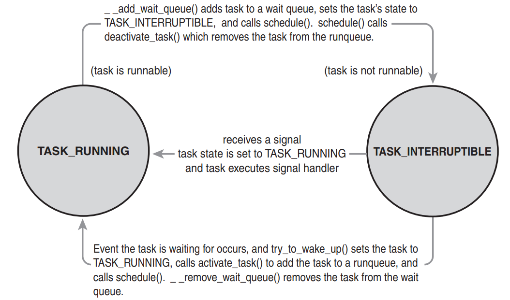

# Chapter 4: Process Scheduling

The process scheduler decides which process runs, when, and for how long.

## Multitasking

- Multitasking OSs come in two flavors: **cooperative multitasking** and **preemptive multitasking**.
- Linux, like all Unix variants and most modern OSs, implements **preemptive** multitasking.
- The time a process runs before it is preempted is usually predetermined, and it is called the **timeslice** of the process.

## Linux’s Process Scheduler

- From Linux’s first version in 1991 through the *2.4* kernel series:
  - the Linux scheduler was simple, almost pedestrian, in design 🤷.
  - easy to understand, but **scaled poorly** in light of **many runnable processes** or **many processors**.
- During the *2.5* kernel development series, the Linux kernel received a scheduler overhaul:
  - A new scheduler, commonly called the **O(1) scheduler** because of its algorithmic behavior.
  - performed admirably and scaled effortlessly as Linux supported large “*iron*” with tens if not hundreds of processors.
  - ideal for large server workloads; which lack interactive processes; but not optimal for **interactive processes**.
- in early *2.6* kernel series, developers introduced new process schedulers aimed at improving the *interactive performance* of the *O(1)* scheduler:
  - most notable of these was the **Rotating Staircase Deadline** scheduler, which introduced the concept of fair scheduling.
  - this concept was the inspiration for the O(1) scheduler’s eventual replacement in kernel version 2.6.23, the **Completely Fair Scheduler** (CFS).

## Policy

- Is the behavior of the scheduler that determines **what runs when**.

### I/O-Bound Versus Processor-Bound Processes

- Processes can be classified as either **I/O-bound** or **processor-bound**.
- The former is characterized as a process that spends much of its time **submitting** and **waiting on I/O** requests.
- Conversely, **processor-bound** processes spend much of their time **executing code**.

### Process Priority

- The goal of **priority-based** scheduling algo is to **rank processes** based on their **worth** and **need** for **processor time**.
- The linux kernel implements two separate priority ranges:
  - the first is the **nice value**, a number from **–20 to +19** with a default of 0.
  - **larger** nice values correspond to a **lower** priority
  - `ps -el`: to list processes with their nice values (NI)
- The second range is the **real-time** priority.
  - configurable, but by default range from **0 to 99**, inclusive.
  - **higher** real-time priority values correspond to a **greater** priority.
  - `ps -eo state,uid,pid,ppid,rtprio,time,comm`: (RTPRIO)

### Timeslice

- is the numeric value that represents how long a task can run until it is preempted.
- the scheduler policy must dictate a **default timeslice**, which is not a trivial exercise.
- too long a timeslice causes the system to have poor interactive performance.
- too short a timeslice causes significant amounts of processor time to be wasted on the overhead of context switching.
- additionally, the conflicting goals of I/O bound versus processor-bound processes again arise:
  - I/O-bound processes do not need longer timeslices (although they do like to run often).
  - whereas processor-bound processes crave long timeslice.
- linux’s CFS scheduler does not directly assign timeslices to processes; instead; in a novel approach, CFS assigns processes a **proportion** of the processor.
- the amount of processor time that a process receives is a function of the load of the system.
- this assigned proportion is further affected by each process’s nice value.
- processes with higher nice values (a lower priority) receive a deflationary weight, yielding them a smaller proportion of the processor;
- processes with smaller nice values (a higher priority) receive an inflationary weight, netting them a larger proportion of the processor.

### The Scheduling Policy in Action

- On most OSs, to ensure good **interactive performance**, text editor a higher priority and larger timeslice than the video encoder. Advanced OSs do this automatically, by detecting that the text editor is interactive.
- Linux achieves these goals too, but by different means. Instead of assigning the text editor a specific priority and timeslice, it guarantees the text editor a specific **proportion of the processor**.

## The Linux Scheduling Algorithm

### Scheduler Classes

- the Linux scheduler is **modular**, enabling different algorithms to schedule different types of processes.
- this modularity is called **scheduler classes**.
- each scheduler class has a **priority**.
- the **base scheduler code**, which is defined in `kernel/sched.c`, iterates over each scheduler class in order of priority.
- the **highest** priority scheduler class that has a runnable process wins, selecting who runs next.

### Process Scheduling in Unix Systems

- modern process schedulers have two common concepts: **process priority** and **timeslice**.
- timeslice is how long a process runs; processes start with some default timeslice.
- processes with a **higher priority** run **more frequently** and (on many systems) receive a higher timeslice.
- on Unix, the priority is exported to user-space in the form of nice values. This sounds simple, but in practice it
  leads to several pathological problems: - mapping nice values onto timeslices requires a decision about what absolute timeslice to allot each nice value. - relative nice values and again the nice value to timeslice mapping. - if performing a nice value to timeslice mapping, we need the ability to assign an absolute timeslice. - process wake up in a priority-based scheduler that wants to optimize for interactive tasks.
- the true problem, which is that assigning **absolute timeslices** yields a **constant switching rate** but **variable fairness**.

### Fair Scheduling

- CFS is based on a simple concept: _Model process scheduling as if the system had an ideal, perfectly multitasking processor_.
- in such a system, each process would receive `1/n` of the processor’s time, where `n` is the number of **runnable processes**, and we’d schedule them for infinitely small durations, so that in any measurable period we’d have run all `n` processes for the same amount of time:
  - impractical, because it is not possible on a single processor to literally run multiple processes simultaneously
  - not efficient to run processes for infinitely small durations (the overhead of context switches + the effects on caches).
- CFS is mindful of the overhead and performance hit in doing so. Instead, CFS will run each process for some amount of time **round-robin**, selecting next the process that has run the least.
- rather than assign each process a timeslice, CFS calculates how long a process should run as a function of **the total number of runnable processes**.
- instead of using the nice value to calculate a timeslice, CFS uses the **nice** value to **weight** the proportion of processor a process is to receive: Higher valued (lower priority) processes receive a fractional weight relative to the default nice value, whereas lower valued (higher priority) processes receive a larger weight.
- each process then runs for a timeslice **proportional** to its weight **divided** by the **total weight** of all runnable threads.
- note that CFS isn’t perfectly fair, because it only **approximates perfect multitasking**, but it can place a lower bound on latency of `n` for `n` runnable processes on the unfairness.

## The Linux Scheduling Implementation

- lives in `kernel/sched_fair.c`.
- we discuss four components of CFS:
  - Time Accounting
  - Process Selection
  - The Scheduler Entry Point
  - Sleeping and Waking Up

### Time Accounting

- all process schedulers must account for the time that a process runs.
- most unix systems do so with timeslices.
  - on each tick of the system clock, the timeslice is decremented by the tick period.
  - when the timeslice reaches zero, the process is preempted in favor of another runnable process with a nonzero timeslice
- CFS does not have the notion of a timeslice, it uses the **scheduler entity structure**, `struct sched_entity`, defined in `<linux/sched.h>`, to keep track of process accounting.
  - this structure is embedded in the process descriptor, struct `task_stuct`, as a member variable named `se`.
- the **vruntime variable** stores the virtual runtime of a process, which is the actual runtime (the amount of time spent running) normalized (or weighted) by the number of runnable processes.
- `update_curr()`, defined in `kernel/sched_fair.c`, manages this accounting.

### Process Selection

- when CFS is deciding what process to run next, it picks the process with the **smallest vruntime**.
- CFS uses a _red-black tree_ to manage the list of runnable processes and efficiently find the process with the **smallest vruntime**
- the function that performs this selection is `__pick_next_entity()`, defined in `kernel/sched_fair.c`.

## The Scheduler Entry Point

- the main entry point into the process schedule is the function `schedule()`, defined in `kernel/sched.c`.
- it finds the highest priority scheduler class with a runnable process and asks it what to run next.
- `pick_next_task()` goes through each scheduler class, starting with the **highest priority**, and selects the highest priority process in the highest priority class.

## Sleeping and Waking Up

- the task marks itself as **sleeping**, puts itself on a **wait queue**, **removes** itself from the red-black tree of runnable, and calls `schedule()` to select a new process to execute.
- waking back up is the inverse: the task is set as **runnable**, removed from the **wait queue**, and added back to the red-black tree.

### Wait Queues

- sleeping is handled via wait queues.
- wait queue is a simple list of processes waiting for an event to occur.
- are represented in the kernel by `wake_queue_head_t`.
- are created statically via `DECLARE_WAITQUEUE()` or dynamically via `init_waitqueue_head()`.
- the task performs the following steps to add itself to a wait queue:

```c
/* ‘q’ is the wait queue we wish to sleep on */
    DEFINE_WAIT(wait);
    add_wait_queue(q, &wait);
    while (!condition) { /* condition is the event that we are waiting for */
        prepare_to_wait(&q, &wait, TASK_INTERRUPTIBLE);
        if (signal_pending(current))
            /* handle signal */
        schedule();
    }
finish_wait(&q, &wait);
```

### Waking Up

- waking is handled via `wake_up()`, which wakes up all the tasks waiting on the given wait queue.
- tt calls `try_to_wake_up()`, which sets the task’s state to `TASK_RUNNING`, calls `enqueue_task()` to add the task to the red-black tree, and sets **need_resched** if the awakened task’s priority is higher than the priority of the current task.
- an important note about sleeping is that there are **spurious** wake-ups.
  - just because a task is awakened does not mean that the event for which the task is waiting has occurred.
  - sleeping should always be handled in a loop that ensures that the condition for which the task is waiting has indeed occurred.
- the figure below depicts the relationship between each scheduler state:

<p align="center"></p>

## Preemption and Context Switching

### Context Switching

- **context switching**, the switching from one runnable task to another.
- is handled by the `context_switch()` defined in `kernel/sched.c`.
- is called by `schedule()` when a new process has been selected to run.
- does two basic jobs:
  - calls `switch_mm()`, which is declared in `<asm/mmu_context.h>`, to switch the virtual memory mapping from the previous process’s to that of the new process.
  - calls `switch_to()`, declared in `<asm/system.h>`, to switch the processor state from the previous process’s to the current’s.This involves saving and restoring stack information and the processor registers and any other architecture-specific state that must be managed and restored on a per-process basis.
- the kernel provides the `need_resched` flag to signify whether a reschedule should be performed.
- this flag is set :
  - by `scheduler_tick()` when a process should be preempted, and;
  - by `try_to_wake_up()` when a process that has a higher priority than the currently running process is awakened.

### User Preemtpion

- **user preemption** can occur:
  - when returning to user-space from a system call.
  - when returning to user-space from an interrupt handler.

### Kernel Preemption

- unlike most other Unix variants and many other OSs, linux kernerl is a **fully preemptive kernel**.
- the kernel can preempt a task running in the kernel so long as it **does not hold a lock**.
- kernel preemption can occur
  - when an interrupt handler exits, before returning to kernel-space.
  - when kernel code becomes preemptible again.
  - if a task in the kernel explicitly calls `schedule()`.
  - if a task in the kernel blocks (which results in a call to `schedule()`).

## Real-Time Scheduling Policies

- linux provides two **real-time** scheduling policies, **SCHED_FIFO** and **SCHED_RR**.
- the normal, not real-time scheduling policy is **SCHED_NORMAL**.
- these real time polciies are managed by a special real-time scheduler, defined in `kernel/sched_rt.c`.
- **SCHED_FIFO**:
  - implements a simple first-in, first-out scheduling algorithm without timeslices.
  - a runnable **SCHED_FIFO** task is always scheduled over any **SCHED_NORMAL** tasks.
  - when a SCHED_FIFO task becomes runnable, it continues to run until it blocks or explicitly yields the processor; it has no timeslice and can run indefinitely.
  - only a higher priority SCHED_FIFO or SCHED_RR task can preempt a SCHED_FIFO task.
- **CHED_RR**:
  - is identical to SCHED_FIFO except that each process can run only until it exhausts a predetermined timeslice.
  - that is, SCHED_RR is SCHED_FIFO with timeslices.
  - is a real-time, round-robin scheduling algorithm.
  - when a SCHED_RR task exhausts its timeslice, any other real-time processes at its priority are scheduled round-robin.
- both real-time scheduling policies implement **static priorities**.
  - ensures that a real-time process at a given priority **always** preempts a process at a lower priority.
- real-time scheduling policies in Linux provide **soft real-time** behavior.
  - refers to the notion that the kernel tries to schedule applications within timing deadlines,
  - but the kernel does not promise to always achieve these goals.
- conversely, **hard real-time** systems are guaranteed to meet any scheduling requirements within certain limits.
  - Linux makes no guarantees on the capability to schedule real-time tasks.

## Scheduler-Related System Calls

scheduler related system calls:

| System Call                | Description                         |
| -------------------------- | ----------------------------------- |
| `nice()`                   | Sets a process’s nice value         |
| `sched_setscheduler()`     | Sets a process’s scheduling policy  |
| `sched_getscheduler()`     | Gets a process’s scheduling policy  |
| `sched_setparam()`         | Sets a process’s real-time priority |
| `sched_getparam()`         | Gets a process’s real-time priority |
| `sched_get_priority_max()` | Gets the maximum real-time priority |
| `sched_get_priority_min()` | Gets the minimum real-time priority |
| `sched_rr_get_interval()`  | Gets a process’s timeslice value    |
| `sched_setaffinity()`      | Sets a process’s processor affinity |
| `sched_getaffinity()`      | Gets a process’s processor affinity |
| `sched_yield()`            | Temporarily yields the processor    |
