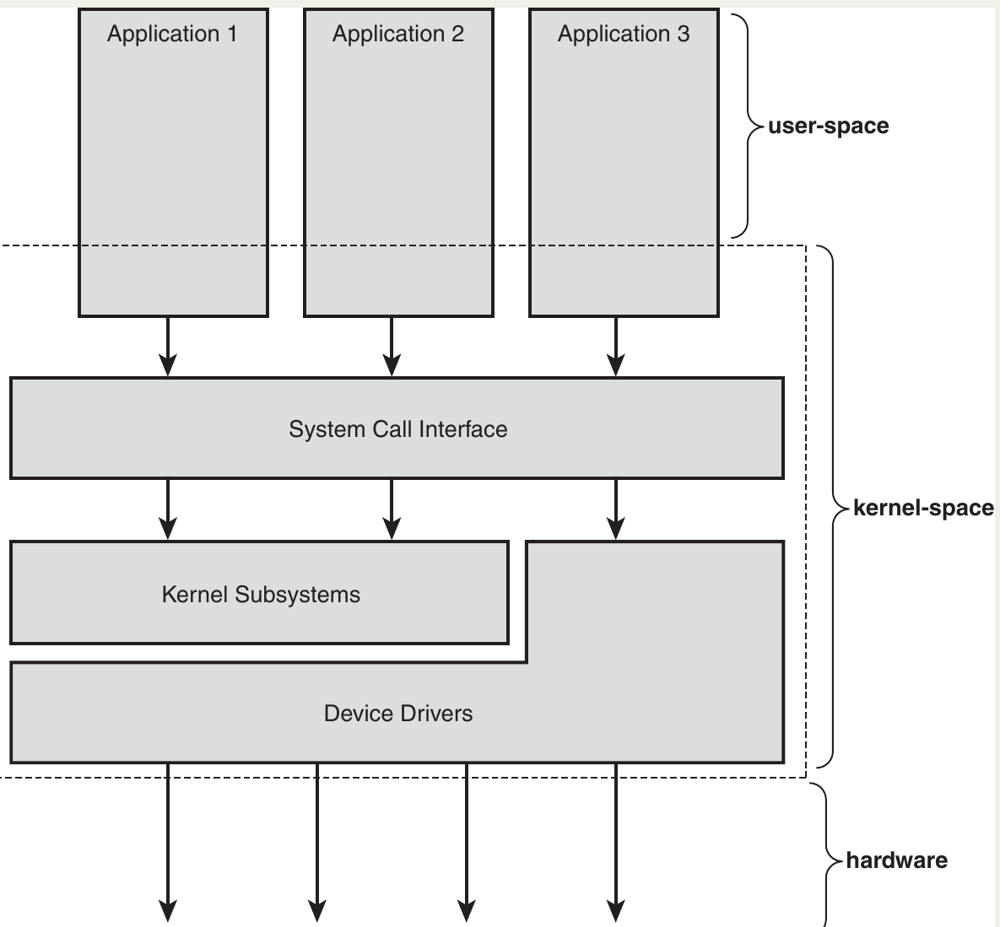
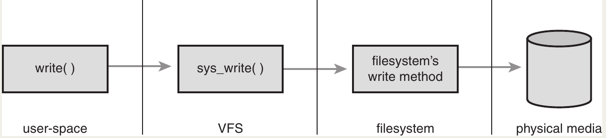

# The Virtual Filesystem

The Virtual Filesystem (VFS) is the subsystem of the kernel that implements the file and filesystem-related interfaces provided to user-space programs.

All filesystems rely on the VFS to enable them not only to **coexist**, but also to **interoperate**.
This enables programs to use standard Unix system calls to read and write to different filesystems, even on different **media**!.

## Common Filesystem Interface

- **VFS** allows Linux to support many different filesystems and storage devices in a **unified** and transparent way. It acts as the _glue_ that makes system calls such as `open()`, `read()`, and `write()` work **independently of the underlying filesystem or physical media**.
- Applications can perform file operations **without caring** whether the file is on:
  - ext4, XFS, Btrfs, FAT, NTFS, etc.
  - Hard drives, SSDs, CDs, Blu-ray, flash storage, etc.
- Files can be **copied or moved across different filesystems** using the same generic system calls.
- Programs do **not need modification or recompilation** when new filesystems or storage devices are introduced.
- Older systems (e.g., DOS) did _not_ provide such abstraction.
- Accessing a filesystem that wasn’t native required **special tools**, and generic system calls could not operate across different filesystems.
- These two subsystems work together:

| Component           | Purpose                                                                              |
| ------------------- | ------------------------------------------------------------------------------------ |
| **VFS**             | Provides a unified interface to all filesystems.                                     |
| **Block I/O Layer** | Abstracts access to various storage media (hard drives, optical discs, flash, etc.). |

Together, they allow user programs to use familiar system calls and paths while the kernel handles all diversity behind the scenes.

## Filesystem Abstraction Layer

- VFS provides a unified _abstraction layer_ on top of low-level filesystem implementations. This layer defines a **common file model** that all filesystems must conform to, regardless of their internal structure or features.
- The VFS defines **common concepts and behaviors**, such as:
  - files
  - directories
  - operations like open, read, write, create, delete, etc.
- Each filesystem shapes its own implementation to _fit into_ this model.
- Filesystem-specific code hides its own internal details and exposes only what the VFS requires.
- Because the VFS only sees a set of **abstract interfaces and data structures**, it doesn’t need to understand how any specific filesystem works internally. The filesystem _implements_ those interfaces, and therefore:
  - Linux can support wildly different filesystems (ext4, XFS, FAT, NTFS, etc.).
  - Filesystems with different behaviors can still be accessed by the **same system calls** from user-space.
  - Even non–Unix-like filesystems (e.g., `FAT`, `NTFS`) can be supported, although the VFS model is biased toward **Unix-style filesystem semantics** 🤷.
- When a syscall such as `write(fd, buf, len);` executes, this happens behind the scenes:
  1. **User-space** triggers the `write()` system call.
  2. The generic `sys_write()` in the kernel handles the call.
  3. The VFS determines **which filesystem** owns `fd`.
  4. The VFS invokes the appropriate filesystem-specific `write` method.
  5. The filesystem writes the data to its medium (disk, flash, etc.).

| Layer                         | Responsibility                                      |
| ----------------------------- | --------------------------------------------------- |
| **User-space**                | Calls generic functions like `write()`              |
| **VFS syscalls**              | Provide a generic frontend for file operations      |
| **Filesystem implementation** | Executes real file access logic for that filesystem |
| **Storage layer**             | Writes data to physical media                       |

## Unix Filesystems

Historically, Unix systems use **four fundamental abstractions** to model files and storage:

| Abstraction                  | Meaning                                                                        |
| ---------------------------- | ------------------------------------------------------------------------------ |
| **File**                     | A sequence of bytes (data).                                                    |
| **Directory Entry (dentry)** | A named reference to a file or directory.                                      |
| **Inode**                    | Metadata describing a file (**permissions**, **owner**, **timestamps**, etc.). |
| **Mount Point**              | A location in the global filesystem hierarchy where a filesystem is attached.  |

- A filesystem is a structured way of storing data on a device.
- Filesystems are **mounted** at a specific place in a **single, unified tree** called the **namespace** (e.g., `/home`, `/mnt/usb`).
- This means that all files across all devices appear as part of the same tree.
- Unlike **Windows**, which splits storage into drive letters (`C:`, `D:`), Unix keeps everything under a single universal directory hierarchy. This prevents hardware details from “leaking” into the user-facing abstraction.
- **File**
  - A **file is simply a byte stream**: nothing more than an ordered sequence of bytes.
  - A file has a **human-readable name**, which is stored in a _directory entry_ (not inside the file itself).
  - Typical operations include: read, write, create, delete.
- **Directory**
  - A **directory is just a file** whose contents list names (dentries) mapped to inodes.
  - Directories contain files and subdirectories.
  - Every part of a path (`/home/user/file.txt`) is a **directory entry** or **dentry**.
- **Inode**
  - File metadata (permissions, owner, timestamps, size, etc.) lives in **inodes**, not in directory entries.
  - An inode does **not know the file name** — names live in _dentries_. A file can have multiple names (hard links point multiple dentries to the same inode).
- **Superblock?**
  - A filesystem stores global metadata in a **superblock**.
  - Contains system-level info such as:
    - filesystem type
    - size and layout
    - inode and block allocation information
  - Together, this metadata (inode + superblock + other details) is called **filesystem metadata**.
- **Unix-inspired filesystems** (ext4, XFS, etc.) physically store inodes, directories-as-files, and superblocks on disk.
- **Non-Unix filesystems** (FAT, NTFS):
  - may not have explicit inodes;
  - may treat directories differently.
  - But **Linux still forces them to present these abstractions** to the VFS. They **emulate** Unix-style objects _in-memory_ if they don’t exist on disk.
  - ➡️ Example: If FAT has no inode concept, the Linux FAT driver **constructs fake inodes dynamically**.
  - 🧠 **Result:** Even non-Unix filesystems behave like Unix filesystems from Linux’s perspective.

## VFS Objects and Their Data Structures

- Even though Linux is written in **C**, the VFS is designed **like an object-oriented system**, using structures that contain both data and **function pointers (methods)**.

### **Core VFS “Objects”**

| VFS Object                   | Represents                                                              |
| ---------------------------- | ----------------------------------------------------------------------- |
| **superblock**               | A specific mounted filesystem (e.g., an ext4 volume).                   |
| **inode**                    | A specific file and its metadata.                                       |
| **dentry (directory entry)** | A path component: file or directory name in a path (`/home/user/file`). |
| **file**                     | An open file (per process).                                             |

- ⚠️ There is **no separate “directory object”**. A directory is just a special kind of file. The *dentry* object only represents **names/paths**, not the directory file itself.

Each primary object has a corresponding **operations structure** containing pointers to functions—like virtual methods in OOP:

| Operations Object     | Contains Methods For…                                             |
| --------------------- | ----------------------------------------------------------------- |
| **super_operations**  | Managing a filesystem (e.g., `write_inode()`, `sync_fs()`).       |
| **inode_operations**  | Actions on a file (e.g., `create()`, `link()`).                   |
| **dentry_operations** | Actions on directory entries (e.g., `d_compare()`, `d_delete()`). |
| **file_operations**   | Actions on an open file (e.g., `read()`, `write()`).              |

- Filesystems can use default **generic** implementations or provide their own.

### **Additional Important Structures**

| Structure                   | Purpose                                                  |
| --------------------------- | -------------------------------------------------------- |
| **file_system_type**        | Describes a registered filesystem (like ext4, FAT, XFS). |
| **vfsmount**                | Represents a mount point.                                |
| **fs_struct (per process)** | Tracks the process’s current root and working directory. |
| **file (per process)**      | Represents one open file descriptor.                     |
