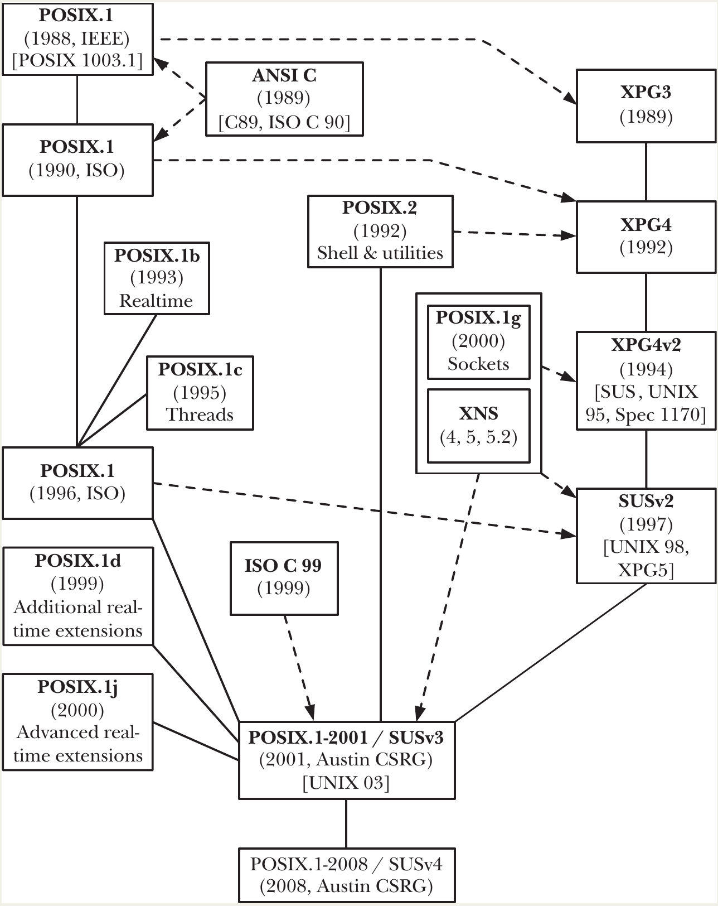

# History and Standards

## A Brief History of UNIX and C

- Linux is part of the broader UNIX family. The term “UNIX” has two meanings:
  - **Official UNIX®** systems certified by The Open Group. (Linux and BSD are _not_ certified.)
  - **UNIX-like systems** behaving like classical UNIX (Bell Labs, System V, BSD). By this definition, Linux is considered UNIX-like.
- The 📑 follows this second definition.
- **1969**: _Ken Thompson_ created the first UNIX version at _AT&T Bell Labs_ on a **PDP-7**.
- Early designs were influenced by the `MULTICS` project (e.g., tree filesystem, shell, byte-stream files).
- **1970–1973**: UNIX was ported to the **PDP-11** and later rewritten almost entirely in the newly developed **C language**.
- C evolved from BCPL → B → C, designed specifically for building UNIX.
- Its portability and efficiency explain why C became the dominant systems programming language.

### Growth of UNIX (1971–1979)

- UNIX passed through several editions (1st–6th) during the 1970s.
- Gained many staple tools (sh, ls, cp, rm, chmod, etc.)
- Introduced the C compiler and pipes.
- By **1975–1977**, UNIX was spreading widely, especially in universities.
- AT&T’s inability to _sell_ software (due to monopoly restrictions 🤷‍♀️) led to inexpensive distributions that included source code, fueling research and education.
- 👉 This openness helped spread UNIX knowledge globally.

### Divergence into BSD and System V

From the **7th Edition (1979)** onward, UNIX split into two major lineages:

### BSD (Berkeley Software Distribution)

- Developed at UC Berkeley, led by _Bill Joy_ and others.
- Added major innovations: **vi**, **C shell**, Fast File System, **sendmail**, Pascal compiler, virtual memory.
- **4.2BSD (1983)** introduced full **TCP/IP** and the **sockets API**, shaping modern networking.
- BSD became the basis for many systems, including *SunOS*.

### System V (AT&T)

- After AT&T was broken up (1982), it was allowed to sell UNIX commercially.
- Released **System III (1981)** and **System V (1983)**.
- **SVR4 (1989)** consolidated many BSD features into the AT&T line.
- Became the base for many commercial UNIXes (HP-UX, AIX, Solaris, etc.).

### UNIX in the 1980s

By the late 1980s, UNIX existed in many commercial and academic variants across diverse hardware:

- SunOS/Solaris
- IBM AIX
- HP-UX
- NeXTStep
- Apple A/UX
- SCO/Microsoft XENIX
- Digital’s Ultrix and OSF/1

This contrasted with traditional proprietary systems, where hardware and OS were tied tightly to one vendor. UNIX offered portability and avoided **vendor lock-in** 🤷‍♀️, making it very attractive to companies.

## A Brief History of Linux

Although “Linux” is commonly used to describe an entire UNIX-like operating system, this is technically imprecise. The **Linux kernel** is only one component; many of the essential user-space tools originate from the **GNU Project**, which predates Linux.

### The GNU Project (1984 → )

- Founded in 1984 by **Richard Stallman** at MIT.
- Motivated by a **moral philosophy of software freedom**, not cost 🤑.
  - Freedom = the right to study, modify, share, and redistribute software.
- Founded the **Free Software Foundation (FSF)** in 1985 to support this mission.
- At the time, BSD systems still contained AT&T-licensed code and were **not** considered free in Stallman’s sense.
- Created the **GNU General Public License (GPL)**, enforcing:
  - Source code availability
  - Free redistribution
  - Mandatory GPL licensing for redistributed modifications
- GPL v1: 1989, v2: 1991 (used by Linux), v3: 2007.
- **Major GNU components**:
  - **Emacs**
  - **GCC** (GNU Compiler Collection)
  - **bash shell**
  - **glibc** (GNU C Library)
- By the early 1990s, GNU had almost a full UNIX system—but **no working kernel**. Their own kernel attempt, **HURD**, was delayed and never reached production readiness.

### The Linux Kernel (1991 → )

- Created by **Linus Torvalds**, a student at the University of Helsinki.
- Inspired by **Minix**, a teaching OS by Andrew Tanenbaum.
- Torvalds wanted a real, efficient UNIX-like system for the 80386 that took full advantage of its hardware.
- On **October 5, 1991**, he announced version **0.02**, inviting other developers to contribute.
- Initially under a restrictive license, but soon relicensed under **GPL**.
- Community contributions expanded features: filesystems, networking, drivers, SMP.
- Major releases:
  - **1.0 (1994)**
  - **1.2 (1995)**
  - **2.0 (1996)**
  - **2.2 (1999)**
  - **2.4 (2001)**
  - **2.6 (2003)**

## An aside: the BSDs

- **386/BSD** (1992) was a free UNIX for x86, derived from BSD Net/2 after removing AT&T code.
- Led to **NetBSD** (1993), **FreeBSD** (1993), **OpenBSD** (1996), later **DragonFly BSD** (2003).
- A major **lawsuit** in 1992–1994 between USL (AT&T subsidiary) and Berkeley slowed BSD progress.
- Resulted in **4.4BSD-Lite (1994)**, which became the base for modern BSDs.

### Linux kernel version numbers

- **Old model (pre-2.6)**
  - Version format: **x.y.z**
  - **Even y = stable**, **odd y = development**
  - New features were added to the development branch, then released as stable.
- **Post-2.6 model**
  - No separate development branch.
  - Each 2.6.z (later 3.x, 4.x, 5.x, 6.x) includes both features and stabilization.
  - ~3-month release cycles.
  - Urgent fixes create **2.6.z.r** revisions.
  - Distributions take more responsibility for overall system stability.

### Ports to other hardware architectures

Originally for the Intel 80386, Linux gradually expanded to many architectures:

- x86-64, PowerPC, PowerPC64, SPARC, MIPS, ARM, IBM zSeries, Itanium, SuperH, PA-RISC, Motorola 68000, and more.

### Linux distributions

- “Linux” in common usage means: **kernel + GNU tools + additional software packaged together**.
- **Early distributions (1992–1993)**
  - MCC Interim Linux
  - TAMU
  - SLS
  - **Slackware (1993)** – oldest surviving commercial distro
  - **Debian (1993)**
  - **SUSE and Red Hat (mid-1990s)**
  - **Ubuntu (2004)**
- Distributors make installation easy and often contribute directly to upstream free software projects.

## Standardization

By the late 1980s, UNIX had fragmented into many incompatible variants (BSD-based, System V–based, hybrids, and vendor-customized versions). This made software portability very difficult and created strong pressure to standardize:
  - **The C language**
  - **The UNIX API**
  - **System utilities and shells**
  - **Networking interfaces**

Below is the evolution of these standards.

### The C Programming Language

- **C89 / ANSI C (1989–1990)**:
  - Reasons for standardization:
    - Different UNIX vendors had slightly **incompatible C compilers**.
    - K&R C lacked exact definitions for many **behaviors**.
    - The emergence of C++ highlighted missing features.
  - The resulting standards:
    - **ANSI C (X3.159-1989)** → later **ISO C90 (ISO/IEC 9899:1990)**
    - Added: prototypes, enums, const/volatile, void, structure assignment, standard libraries.
  - 👉 This version is commonly called **C89** or **C90**.
- **C99 (1999)**:
  - Added: `long long`,  `//` style comments, `bool`, variable-length arrays, restricted pointers, more math extensions
- 📌 C standards are **OS-independent**, so plain C programs are portable across systems.

### The First POSIX Standards

- POSIX = **Portable Operating System Interface**
- Created by the IEEE PASC committee to ensure application **portability**.
- *Richard Stallman* suggested the name “POSIX.”
- **POSIX.1 (1988, ISO in 1990)** defines:
  - System call API
  - C library functions
  - Process, signals, files, directories
  - Conformance rules (an OS can be certified)
  - POSIX.1 was based partly on the `/usr/group` standard.
- **POSIX.1b (Realtime, 1993)** adds:
  - realtime scheduling
  - timers
  - async I/O
  - semaphores
  - message queues
  - shared memory
  - (Collectively called **POSIX realtime**.)
- **POSIX.1c (Threads, 1995)** introduces **POSIX threads (pthreads)**.
- **POSIX.1g (Networking, 2000)** defines **sockets API** and networking behavior.
- **POSIX.2 (1992/1993)** standardizes:
  - The shell
  - Command-line utilities
  - Compiler command interface

### FIPS 151-1 and 151-2 (Federal Information Processing Standard)

- The **government** required POSIX-compliant systems for procurement.
- FIPS 151-1 and 151-2 enforced:
  - POSIX.1 + ANSI C (and required certain optional POSIX features)
- These standards heavily influenced vendors but were **withdrawn** in 2000 🤷‍♀️.

### X/Open Company and The Open Group

- X/Open Company was a consortium formed to unify UNIX standards and produce the **X/Open Portability Guide (XPG)**.
- Major versions:
  - **XPG3 (1989)**
  - **XPG4 (1992)**
  - **XPG4v2 / Spec 1170 (1994)**
    - → contained _1170 defined interfaces_
    - → merged with System V Interface Definition (SVID)
- When `X/Open` acquired the UNIX trademark (1994), `XPG4v2` was renamed: **SUSv1 / UNIX 95**, later to **SUSv2 / UNIX 98 (1997)**
- Two competing consortia:
  - **OSF (Open Software Foundation)** (Digital, IBM, HP…)
  - **UNIX International** (AT&T + Sun)
- Eventually merged (1996) → **The Open Group**, which maintains UNIX standards today.

## SUSv3 and POSIX.1-2001

- In the late 1990s, IEEE, ISO, and The Open Group unified all standards into a single document via the **Austin Group**.
- **POSIX.1-2001 / SUSv3 (2001, updated 2003 & 2004)** consolidated:
  - POSIX.1
  - POSIX.2
  - POSIX realtime
  - POSIX threads
  - Networking specifications
  - X/Open specifications
- SUSv3 has ~3700 pages and four major parts:
  - **XBD** – Base definitions, header specs
  - **XSH** – System interfaces (1123 APIs)
  - **XCU** – Shell and utilities (160 utilities)
  - **XRAT** – Rationale
- Also includes:
  - **X/Open Curses (XCURSES)**.
- Two conformance levels:
  - **POSIX-conformant**
  - **XSI-conformant** (required for UNIX branding → UNIX 03)
- **Unspecified**, **Weakly Specified**, and **Legacy** Features
  - **Unspecified**: Not defined in the standard.
  - **Weakly specified**: Defined, but leaves important behavior undefined.
  - **LEGACY**: Kept only for backward compatibility; should be avoided in new code.

### SUSv4 and POSIX.1-2008

- Changes:
  - Added new functions: `fdopendir()`, `dirfd()`, `utimensat()`, `openat()`, etc.
  - Some SUSv3 optional APIs became mandatory.
  - Some obsolete APIs removed: `vfork()`, `gethostbyname()`, `gethostbyaddr()`
  - More async-signal-safe functions.

### Implementation Standards

- Two major “reference implementations” also acted as de facto standards:
  - **System V Interface Definition (SVID3)** for SVR4
  - **4.4BSD** interface behavior
- Many UNIX-like systems provide compatibility modes for one or the other.

### Linux, Standards, and the Linux Standard Base

- Linux aims for: **High compatibility with POSIX and SUS**, but does not pursue official UNIX branding due to **cost** and **release frequency**.
- Reasons Linux isn’t branded as UNIX:
  - Certification must be redone for each distro release → expensive & slow 🫤.
  - Linux development is decentralized.
- Linux ecosystem:
  - Kernel is **independent** from distributions.
  - Contributors include volunteers and employees from companies like IBM, HP, Red Hat.
  - The Linux Foundation supports coordination.
- Linux distributions use **Linux Standard Base (LSB)** to improve consistency.
