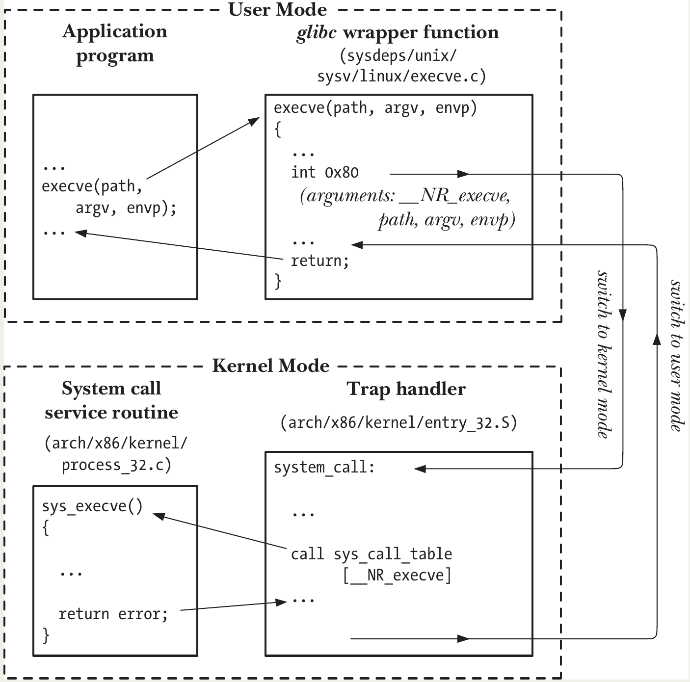

# File I/O: The Universal I/O Model

- **File Descriptors (FDs)**: All I/O system calls use **file descriptors** — small, nonnegative integers — to identify open files.  
  Every process has its own independent set of file descriptors.
- They can refer to **any type** of open file: regular files, pipes, sockets, terminals, devices, etc.
- By convention, every process inherits three standard file descriptors from its parent (usually the shell):

| FD  | Purpose         | POSIX name    | stdio stream | Typical default (in shell) |
| --- | --------------- | ------------- | ------------ | -------------------------- |
| 0   | Standard input  | STDIN_FILENO  | stdin        | Keyboard/terminal          |
| 1   | Standard output | STDOUT_FILENO | stdout       | Screen/terminal            |
| 2   | Standard error  | STDERR_FILENO | stderr       | Screen/terminal            |

- Use the **POSIX names** (`STDIN_FILENO`, etc.) from `<unistd.h>` instead of hardcoding 0, 1, 2 — better for readability and portability.
- The **stdio streams** (`stdin`, `stdout`, `stderr`) initially point to FDs 0, 1, 2, but you can reassign them with `freopen()` — after which the underlying FD may change (so don't assume `stdout` is always FD 1).
<p align="center"></p>

- These are the fundamental system calls for file I/O (higher-level libraries like stdio wrap them):
  - **`open(pathname, flags, mode)`**  
    Opens (or creates) a file and returns a new file descriptor.
    - `flags`: Bitmask controlling mode (read, write, append, create, etc.).
    - `mode`: Permissions if the file is created (ignored otherwise).
  - **`read(fd, buffer, count)`**  
    Reads **up to** `count` bytes from the open file into `buffer`.  
    Returns the actual number of bytes read (0 = EOF).
  - **`write(fd, buffer, count)`**  
    Writes **up to** `count` bytes from `buffer` to the file.  
    Returns the actual number of bytes written (may be less than `count`).
  - **`close(fd)`**  
    Closes the file descriptor and frees kernel resources.

## Universality of I/O

- The same **four system calls** — `open()`, `read()`, `write()`, and `close()` — work for **all types of files**:
  - Regular files
  - Devices (e.g., terminals, disks, serial ports)
  - Pipes, FIFOs, sockets, etc.
- This means a program written using only these calls becomes **device-independent** — it can read from or write to almost anything without needing special code for each type.
- The simple `copy` program from Listing 4-1 (your basic `cp` clone) works in many contexts:

| Command                       | What it does                                                              |
| ----------------------------- | ------------------------------------------------------------------------- |
| `./copy test test.old`        | Copies one regular file to another                                        |
| `./copy a.txt /dev/tty`       | Copies file contents to the current terminal                              |
| `./copy /dev/tty b.txt`       | Copies input from the terminal to a regular file                          |
| `./copy /dev/pts/16 /dev/tty` | Copies input from another terminal (e.g., pts/16) to the current terminal |

- Every **file system** and **device driver** in the kernel implements the same set of I/O system calls.
- Device-specific details are hidden inside the kernel.
- Applications stay simple and portable — they rarely need to care about the underlying type.
- For device-specific or advanced features not covered by the basic I/O model, use the `ioctl()` system call .

## Opening a File: open()

```c
#include <fcntl.h>
int open(const char *pathname, int flags, ... /* mode_t mode */);
```

- Args:
  - **pathname**: Path to the file (symbolic links are dereferenced).
  - **flags**: Bitmask specifying how to open the file (required).
  - **mode**: Permissions for newly created files (only needed when `O_CREAT` is used).
- Returns: **file descriptor** (nonnegative integer) on success, or **–1** on error (sets `errno`).
- File access modes (mutually exclusive — use exactly one)
  | Flag | Value (historical) | Description |
  |-------------|--------------------|--------------------------------------|
  | `O_RDONLY` | 0 | Open for reading only |
  | `O_WRONLY` | 1 | Open for writing only |
  | `O_RDWR` | 2 | Open for both reading and writing |

- ⚠️ `O_RDWR` is **not** the same as `O_RDONLY | O_WRONLY` — the latter is invalid.

- `open()` always uses the **lowest unused file descriptor** in the process.
- You can force a specific FD (e.g., FD 0 for stdin) like this:
  ```c
  close(STDIN_FILENO);              // free FD 0
  fd = open("file.txt", O_RDONLY);  // guaranteed to use FD 0
  ```

Flags are grouped into three categories:

| Flag                                                             | Purpose                                                       | SUSv3/SUSv4 |
| ---------------------------------------------------------------- | ------------------------------------------------------------- | ----------- |
| **Access mode** (one of the three above)                         |                                                               |             |
| **Creation flags** (set at open time, can't change later)        |                                                               |             |
| `O_CREAT`                                                        | Create file if it doesn't exist (requires `mode` argument)    | Yes         |
| `O_EXCL`                                                         | With `O_CREAT`: fail if file already exists (atomic create)   | Yes         |
| `O_TRUNC`                                                        | Truncate regular file to 0 length if it exists                | Yes         |
| `O_DIRECTORY`                                                    | Fail if pathname is not a directory                           | No          |
| `O_NOFOLLOW`                                                     | Fail if pathname is a symbolic link                           | No          |
| **Open file status flags** (can be changed later with `fcntl()`) |                                                               |
| `O_APPEND`                                                       | All writes append to end of file                              | Yes         |
| `O_NONBLOCK`                                                     | Open in nonblocking mode                                      | Yes         |
| `O_SYNC`                                                         | Synchronous writes (data + metadata)                          | Yes         |
| `O_DSYNC`                                                        | Synchronous writes (data only)                                | Yes         |
| `O_ASYNC`                                                        | Signal-driven I/O (terminals, pipes, sockets)                 | No          |
| `O_CLOEXEC`                                                      | Set close-on-exec flag (useful in multithreaded programs)     | Yes         |
| `O_NOATIME`                                                      | Don't update last access time on reads                        | No          |
| `O_DIRECT`                                                       | Bypass page cache for direct I/O                              | No          |
| `O_LARGEFILE`                                                    | Enable large file support (mostly obsolete on 64-bit systems) | No          |
| `O_NOCTTY`                                                       | Don't make this terminal the controlling terminal             | Yes         |

#### Common Errors from `open()`

| Error     | Meaning                                                          |
| --------- | ---------------------------------------------------------------- |
| `EACCES`  | Permission denied (file/dir) or no permission to create          |
| `EISDIR`  | Tried to open directory for writing                              |
| `EMFILE`  | Process file descriptor limit reached                            |
| `ENFILE`  | System-wide file limit reached                                   |
| `ENOENT`  | File doesn't exist and `O_CREAT` not used, or parent dir missing |
| `EROFS`   | Trying to write to read-only filesystem                          |
| `ETXTBSY` | Trying to write to an executable that's currently running        |

#### The `creat()` System Call (obsolete)

```c
int creat(const char *pathname, mode_t mode);
```

Equivalent to:

```c
open(pathname, O_WRONLY | O_CREAT | O_TRUNC, mode);
```
