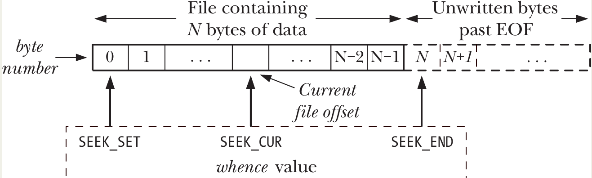

# File I/O: The Universal I/O Model

- **File Descriptors (FDs)**: All I/O system calls use **file descriptors** — small, nonnegative integers — to identify open files.  
  Every process has its own independent set of file descriptors.
- They can refer to **any type** of open file: regular files, pipes, sockets, terminals, devices, etc.
- By convention, every process inherits three standard file descriptors from its parent (usually the shell):

| FD  | Purpose         | POSIX name    | stdio stream | Typical default (in shell) |
| --- | --------------- | ------------- | ------------ | -------------------------- |
| 0   | Standard input  | STDIN_FILENO  | stdin        | Keyboard/terminal          |
| 1   | Standard output | STDOUT_FILENO | stdout       | Screen/terminal            |
| 2   | Standard error  | STDERR_FILENO | stderr       | Screen/terminal            |

- Use the **POSIX names** (`STDIN_FILENO`, etc.) from `<unistd.h>` instead of hardcoding 0, 1, 2 — better for readability and portability.
- The **stdio streams** (`stdin`, `stdout`, `stderr`) initially point to FDs 0, 1, 2, but you can reassign them with `freopen()` — after which the underlying FD may change (so don't assume `stdout` is always FD 1).
<p align="center"></p>

- These are the fundamental system calls for file I/O (higher-level libraries like stdio wrap them):
  - **`open(pathname, flags, mode)`**  
    Opens (or creates) a file and returns a new file descriptor.
    - `flags`: Bitmask controlling mode (read, write, append, create, etc.).
    - `mode`: Permissions if the file is created (ignored otherwise).
  - **`read(fd, buffer, count)`**  
    Reads **up to** `count` bytes from the open file into `buffer`.  
    Returns the actual number of bytes read (0 = EOF).
  - **`write(fd, buffer, count)`**  
    Writes **up to** `count` bytes from `buffer` to the file.  
    Returns the actual number of bytes written (may be less than `count`).
  - **`close(fd)`**  
    Closes the file descriptor and frees kernel resources.

## Universality of I/O

- The same **four system calls** — `open()`, `read()`, `write()`, and `close()` — work for **all types of files**:
  - Regular files
  - Devices (e.g., terminals, disks, serial ports)
  - Pipes, FIFOs, sockets, etc.
- This means a program written using only these calls becomes **device-independent** — it can read from or write to almost anything without needing special code for each type.
- The simple `copy` program from Listing 4-1 (your basic `cp` clone) works in many contexts:

| Command                       | What it does                                                              |
| ----------------------------- | ------------------------------------------------------------------------- |
| `./copy test test.old`        | Copies one regular file to another                                        |
| `./copy a.txt /dev/tty`       | Copies file contents to the current terminal                              |
| `./copy /dev/tty b.txt`       | Copies input from the terminal to a regular file                          |
| `./copy /dev/pts/16 /dev/tty` | Copies input from another terminal (e.g., pts/16) to the current terminal |

- Every **file system** and **device driver** in the kernel implements the same set of I/O system calls.
- Device-specific details are hidden inside the kernel.
- Applications stay simple and portable — they rarely need to care about the underlying type.
- For device-specific or advanced features not covered by the basic I/O model, use the `ioctl()` system call .

## Opening a File: open()

```c
#include <fcntl.h>
int open(const char *pathname, int flags, ... /* mode_t mode */);
```

- Args:
  - **pathname**: Path to the file (symbolic links are dereferenced).
  - **flags**: Bitmask specifying how to open the file (required).
  - **mode**: Permissions for newly created files (only needed when `O_CREAT` is used).
- Returns: **file descriptor** (nonnegative integer) on success, or **–1** on error (sets `errno`).
- File access modes (mutually exclusive — use exactly one)
  | Flag | Value (historical) | Description |
  |-------------|--------------------|--------------------------------------|
  | `O_RDONLY` | 0 | Open for reading only |
  | `O_WRONLY` | 1 | Open for writing only |
  | `O_RDWR` | 2 | Open for both reading and writing |

- ⚠️ `O_RDWR` is **not** the same as `O_RDONLY | O_WRONLY` — the latter is invalid.
- `open()` always uses the **lowest unused file descriptor** in the process.
- You can force a specific FD (e.g., FD 0 for stdin) like this:
  ```c
  close(STDIN_FILENO);              // free FD 0
  fd = open("file.txt", O_RDONLY);  // guaranteed to use FD 0
  ```

Flags are grouped into three categories:

| Flag                                                             | Purpose                                                       | SUSv3/SUSv4 |
| ---------------------------------------------------------------- | ------------------------------------------------------------- | ----------- |
| **Access mode** (one of the three above)                         |                                                               |             |
| **Creation flags** (set at open time, can't change later)        |                                                               |             |
| `O_CREAT`                                                        | Create file if it doesn't exist (requires `mode` argument)    | Yes         |
| `O_EXCL`                                                         | With `O_CREAT`: fail if file already exists (atomic create)   | Yes         |
| `O_TRUNC`                                                        | Truncate regular file to 0 length if it exists                | Yes         |
| `O_DIRECTORY`                                                    | Fail if pathname is not a directory                           | No          |
| `O_NOFOLLOW`                                                     | Fail if pathname is a symbolic link                           | No          |
| **Open file status flags** (can be changed later with `fcntl()`) |                                                               |
| `O_APPEND`                                                       | All writes append to end of file                              | Yes         |
| `O_NONBLOCK`                                                     | Open in nonblocking mode                                      | Yes         |
| `O_SYNC`                                                         | Synchronous writes (data + metadata)                          | Yes         |
| `O_DSYNC`                                                        | Synchronous writes (data only)                                | Yes         |
| `O_ASYNC`                                                        | Signal-driven I/O (terminals, pipes, sockets)                 | No          |
| `O_CLOEXEC`                                                      | Set close-on-exec flag (useful in multithreaded programs)     | Yes         |
| `O_NOATIME`                                                      | Don't update last access time on reads                        | No          |
| `O_DIRECT`                                                       | Bypass page cache for direct I/O                              | No          |
| `O_LARGEFILE`                                                    | Enable large file support (mostly obsolete on 64-bit systems) | No          |
| `O_NOCTTY`                                                       | Don't make this terminal the controlling terminal             | Yes         |

#### Common Errors from `open()`

| Error     | Meaning                                                          |
| --------- | ---------------------------------------------------------------- |
| `EACCES`  | Permission denied (file/dir) or no permission to create          |
| `EISDIR`  | Tried to open directory for writing                              |
| `EMFILE`  | Process file descriptor limit reached                            |
| `ENFILE`  | System-wide file limit reached                                   |
| `ENOENT`  | File doesn't exist and `O_CREAT` not used, or parent dir missing |
| `EROFS`   | Trying to write to read-only filesystem                          |
| `ETXTBSY` | Trying to write to an executable that's currently running        |

#### The `creat()` System Call (obsolete)

```c
int creat(const char *pathname, mode_t mode);
```

Equivalent to:

```c
open(pathname, O_WRONLY | O_CREAT | O_TRUNC, mode);
```

## Reading from a File: read()

```c
#include <unistd.h>
ssize_t read(int fd, void *buffer, size_t count);
```

- Retrieve data from an open file (or any file-like object) using a file descriptor.
- **Returns**:
  - Number of bytes actually read (≥ 0) on success
  - **0** → end-of-file (EOF) reached
  - **–1** → error (sets `errno`)
- **Args**:
  - `fd` — File descriptor of the open file (returned by `open()`)
  - `buffer` — Pointer to a pre-allocated memory area where data will be stored
  - `count` — Maximum number of bytes to read (type `size_t` = unsigned integer)
- **No automatic memory allocation**: You must supply a buffer large enough to hold up to `count` bytes.
  - (Contrast with some stdio functions like `fgets()` that allocate memory.)
- **Partial reads are normal**:
  - For regular files: usually because you’re near `EOF`.
  - For other types (pipes, FIFOs, sockets, terminals): many reasons (e.g., terminal reads stop at **newline** by default).
  - Always check the return value — it can be less than `count` even on success.
- **Return type `ssize_t`**: Signed integer, can hold –1 for errors and large positive values.
- You **cannot** safely use `printf()` or `strcpy()` directly on the buffer after `read()`, because:
  - `read()` does **not** add a null terminator (`\0`).
  - It reads raw bytes — could be text, binary data, structs, etc.

```c
#define MAX_READ 20
char buffer[MAX_READ + 1];     // +1 for \0
ssize_t numRead;

numRead = read(STDIN_FILENO, buffer, MAX_READ);
if (numRead == -1)
    errExit("read");

buffer[numRead] = '\0';        // Explicitly null-terminate
printf("Input: %s\n", buffer);
```

## Writing to a File: write()

```c
#include <unistd.h>
ssize_t write(int fd, const void *buffer, size_t count);
```

- The counterpart to `read()` for sending data to an open file (or any file-like object).
- **Returns**:
  - Number of bytes actually written (≥ 0) on success
  - **–1** on error (sets `errno`)
- **Args**:
  - `fd` — File descriptor of the open file (from `open()`)
  - `buffer` — Pointer to the data to write
  - `count` — Number of bytes to attempt to write (`size_t` = unsigned integer)
- **Partial writes are possible** (and common):
  - Return value can be less than `count` even on success.
  - For disk files: usually caused by disk full or process hitting the file-size limit (`RLIMIT_FSIZE`).
  - For other types (pipes, sockets, terminals): various reasons (e.g., buffer full, connection closed).
- **Always check the return value** and handle partial writes by looping if needed (similar to `read()`).
- **Buffering in the kernel**:
  - A successful `write()` does **not** guarantee data is immediately on disk.
  - The kernel buffers disk I/O to improve performance (reduces physical disk writes).
  - Actual disk transfer happens later (details in Chapter 13).
  - If you need guaranteed disk write, use `fsync()` or `O_SYNC`/`O_DSYNC` flags on `open()`.

## Closing a File: close()

```c
#include <unistd.h>
int close(int fd);
```
- **Purpose**: Closes an open file descriptor (`fd`), freeing it for reuse by the process.
- **Returns**:
  - **0** on success
  - **–1** on error (sets `errno`)
- **Automatic cleanup**: When a process exits (or is terminated), the kernel automatically closes all its open file descriptors.
- **Best practice** — **Always explicitly close** file descriptors when you’re done with them:
  - Improves code readability and maintainability.
  - Prevents resource leaks — file descriptors are finite (per-process limit).
  - Critical in long-running programs (e.g., daemons, servers, shells) that open many files or sockets.
- Always check the return value:
  ```c
  if (close(fd) == -1)
      errExit("close");  // or handle appropriately
  ```
- Common errors include:
  - Closing an invalid/unopened FD (`EBADF`)
  - Closing the same FD twice (`EBADF`)
  - Filesystem-specific errors (e.g., NFS commit failure — data not written to remote disk)
    - On NFS (Network File System), `close()` can fail if buffered data could not be successfully committed to the remote server.  This is one of the rare cases where `close()` itself can return an error even if earlier `write()` calls succeeded.

## Changing the File Offset: lseek()

- For each open file, the kernel maintains a **file offset** — the byte position where the next `read()` or `write()` will start.
- Offset is relative to the **start** of the file (0 = first byte).
- On `open()`, offset is set to **0**.
- `read()` and `write()` automatically advance the offset by the number of bytes actually transferred.
- Sequential I/O (normal use) just works naturally.

```c
#include <unistd.h>
off_t lseek(int fd, off_t offset, int whence);
```
- **Purpose**: allows random access within a file.
- **Returns**: New file offset on success, or **–1** on error.
- **whence** (base point):
  | Value      | Meaning                                                                 |
  |------------|-------------------------------------------------------------------------|
  | `SEEK_SET` | Set offset to exactly `offset` bytes from the start of the file (offset ≥ 0) |
  | `SEEK_CUR` | Adjust offset by `offset` bytes relative to current position (can be negative) |
  | `SEEK_END` | Set offset to file size + `offset` (i.e., `offset` bytes past the end) |

Common `lseek()` Usage Examples:

| Call                          | Resulting file offset position                          |
|-------------------------------|----------------------------------------------------------|
| `lseek(fd, 0, SEEK_SET)`      | Start of file (byte 0)                                   |
| `lseek(fd, 0, SEEK_END)`      | One byte past the end of the file (file size)            |
| `lseek(fd, -1, SEEK_END)`     | Last byte of the file                                    |
| `lseek(fd, -10, SEEK_CUR)`    | 10 bytes before current position                         |
| `lseek(fd, 10000, SEEK_END)`  | 10000 bytes past the end of the file                     |
| `lseek(fd, 0, SEEK_CUR)`      | Get current offset (no change) — equivalent to `tell(fd)` on some systems |
<p align="center"></p>

- **Restrictions**:
  - `lseek()` **cannot** be used on pipes, FIFOs, sockets, or terminals → fails with `ESPIPE`.
  - It **can** be used on disk files, tape drives, and other seekable devices.
- **File Holes** (Sparse Files):
  - You can `lseek()` past the end of a file and then `write()` data → creates a **file hole**.
  - **Holes** are ranges of zero bytes (null bytes) that exist logically but **do not consume disk space**.
  - Reading from a hole returns a buffer filled with zeros.
  - Disk blocks are allocated only when you actually write data into the hole.
  - Holes are useful for **sparse files** (e.g., core dumps, databases, virtual machine images) — they save disk space.
  - On block-based filesystems, partial blocks at hole edges may still allocate a full block (filled with zeros) 🤷‍♀️.
  - **Non-native filesystems** (e.g., VFAT) often do not support holes and write explicit zeros.
  - Writing into a hole **reduces** free disk space (blocks get allocated) even though file size stays the same.
- `posix_fallocate(fd, offset, len)` — Ensures disk space is pre-allocated for a range (avoids later `write()` failures due to `ENOSPC`).
  - Historically wrote zeros; modern Linux uses efficient `fallocate()` syscall (since kernel 2.6.23).

## Operations Outside the Universal I/O Model: ioctl()

```c
#include <sys/ioctl.h>
int ioctl(int fd, int request, ... /* argp */);
```
- **Purpose**: `ioctl()` is the **catch-all mechanism** for performing operations that don't fit the universal I/O model (`open()`, `read()`, `write()`, `close()`, `lseek()`).
  - Controlling terminal settings
  - Disk partitioning
  - Network interface configuration
  - Tape drive operations
  - Filesystem attributes
- **Returns**:
  - Varies depending on the specific `request` (often 0 on success, or a value like the current setting)
  - **–1** on error (sets `errno`)
- **Args**:
  - `fd` — Open file descriptor for the file or device to control.
  - `request` — Integer constant (defined in device-specific headers) that specifies the exact operation.
  - `argp` — Optional third argument (any type):
    - Usually a **pointer** to an integer or a structure.
    - Sometimes unused (pass `NULL` or omit).
    - The `request` value tells the kernel what type and purpose `argp` has.
- `ioctl()` is **very powerful but non-portable**:
  - SUSv3 only standardizes it for **STREAMS** devices (a System V feature **not** supported in mainline Linux).
  - Almost all other uses are **implementation-specific**.
  - Many `ioctl()` operations are common across UNIX variants (BSD, Solaris, etc.), but details (request codes, argument types) often differ.
