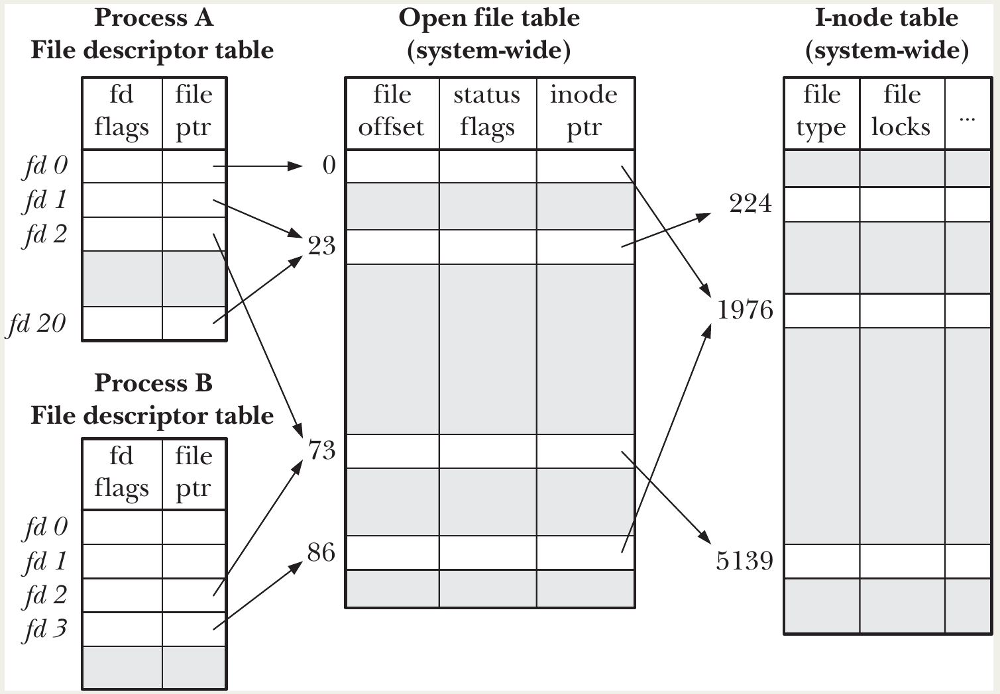

# File I/O: Further Details

- **Atomicity of System Calls**: Every system call is executed **atomically** by the kernel.
  - The entire sequence of steps inside the system call completes as a **single, uninterruptible operation**.
  - No other process or thread can interfere midway through the call.
- This guarantee is crucial for reliable concurrent programming.
- **Race Condition**: A bug where the outcome of a program depends unpredictably on the **relative timing** or **scheduling order** of multiple processes/threads accessing shared resources.
- The result varies depending on which process gets CPU time first — hence "race".

#### Example 1: Creating a File Exclusively (Without Atomicity)

Goal: Ensure only one process creates a file (e.g., for lock files, temp files, or single-instance checks).

**Bad approach** (Listing 5-1 — vulnerable to race):

```c
fd = open(path, O_WRONLY);           // Step 1: Check if file exists
if (fd != -1) {                       // Exists → error/close
    ...
} else if (errno == ENOENT) {
    // WINDOW OF VULNERABILITY
    fd = open(path, O_WRONLY | O_CREAT, mode);  // Step 2: Create it
    printf("I created the file exclusively!\n"); // MAY BE FALSE!
}
```

**The race**:

- Process A: `open()` fails → file doesn't exist.
- Scheduler interrupts A → switches to Process B.
- Process B: does the same → creates the file.
- Scheduler resumes A → A now creates/truncates the file again.
- **Both processes think they exclusively created it** → incorrect and dangerous.

Demonstrated with artificial `sleep(5)` delay: two concurrent runs both claim exclusive creation.

**Correct solution**: 👉 `O_CREAT | O_EXCL`

```c
fd = open(path, O_WRONLY | O_CREAT | O_EXCL, mode);
```

- The kernel **atomically** checks for existence **and** creates the file.
- If file already exists → `open()` fails with `EEXIST`.
- No race window → safe in concurrent environments.

#### Example 2: Appending to a File

Goal: Multiple processes safely append to a shared log file without overwriting each other's data.

**Bad approach** (vulnerable to race):

```c
lseek(fd, 0, SEEK_END);   // Move to end of file
write(fd, buf, len);      // Append data
```

**The race**:

- Process A: `lseek()` to end (say offset 1000).
- Scheduler switches to Process B.
- Process B: `lseek()` to end (still 1000) → writes its data.
- Scheduler resumes A → A writes at offset 1000 → **overwrites B's data**.

**Correct solution**: 👉 Open the file with `O_APPEND`

```c
fd = open(path, O_WRONLY | O_APPEND, ...);
```

- The kernel **atomically** seeks to the current end and writes the data.
- Every `write()` automatically appends, even if multiple processes write concurrently.
- No need for explicit `lseek()`.

**Caveat**: On some filesystems (e.g., older NFS), `O_APPEND` may not be truly atomic — kernel falls back to non-atomic `lseek()+write()`, reintroducing the race risk.

## File Control Operations: fcntl()

`fcntl()` is a **multiplexed** system call that provides a wide range of operations not covered by the basic universal I/O model.

```c
#include <fcntl.h>
int fcntl(int fd, int cmd, ... /* arg */);
```

- **Returns**:
  - Value depends on the specific `cmd` (often 0 on success, a new flag value, or another integer)
  - **–1** on error (sets `errno`)
- **Args**:
  - `fd` — An open file descriptor (must already be opened via `open()`, `pipe()`, `socket()`, etc.).
  - `cmd` — An integer specifying the operation to perform (many possible values).
  - Third argument (`arg`) — Optional and type-varying:
    - Can be an **integer**, a **pointer to a structure**, or omitted entirely.
    - The kernel interprets its type and meaning based on the value of `cmd`.
- **Common uses include**:
  - Retrieving or modifying **file descriptor flags** (e.g., close-on-exec)
  - Retrieving or modifying **file status flags** (e.g., `O_APPEND`, `O_NONBLOCK`)
  - Duplicating file descriptors (`dup()` and `dup2()` are implemented via `fcntl()` in some cases)
  - File locking (advisory and mandatory)
  - Managing signals for asynchronous I/O
  - And many others (covered in later chapters)

## Open File Status Flags

`fcntl()` **retrieve** and **modify** the open file status flags (and access mode) of an already-open file descriptor,

```c
int flags = fcntl(fd, F_GETFL);  // No third argument needed
if (flags == -1) errExit("fcntl");
```

- Returns the current **open file status flags** (the same bits set via `flags` in `open()`).
- Includes both the **access mode** (`O_RDONLY`, `O_WRONLY`, `O_RDWR`) and other status flags (`O_APPEND`, `O_NONBLOCK`, etc.).

**Testing individual flags** (bitwise AND):

```c
if (flags & O_SYNC)          // Check if synchronous writes enabled
    printf("writes are synchronized\n");

if (flags & O_APPEND)
    printf("append mode enabled\n");
```

**Extracting the access mode** (not single bits):

```c
int accessMode = flags & O_ACCMODE;  // Mask to isolate access mode bits

if (accessMode == O_WRONLY || accessMode == O_RDWR)
    printf("file is writable\n");

if (accessMode == O_RDONLY)
    printf("file is read-only\n");
```

- `O_ACCMODE` masks out everything except the access mode (values 0, 1, or 2).

> If the program was compiled for large file support (see Section 5.10), `O_LARGEFILE` is **always** set in the returned flags, even though SUSv3 says only explicitly set flags should be visible.

#### Modifying Flags: `F_SETFL`

```c
if (fcntl(fd, F_SETFL, new_flags) == -1)
    errExit("fcntl");
```

- Third argument: the new flag value (integer).

**Changeable flags** (Linux):

- `O_APPEND`
- `O_NONBLOCK` (nonblocking I/O)
- `O_NOATIME` (don't update access time)
- `O_ASYNC` (signal on I/O possible)
- `O_DIRECT` (bypass buffer cache)

**Non-changeable flags** (ignored if set):

- Access mode (`O_RDONLY`, `O_WRONLY`, `O_RDWR`)
- `O_CREAT`, `O_EXCL`, `O_TRUNC`, etc.
- `O_SYNC`/`O_DSYNC` (on Linux; some other UNIX systems allow changing these)

**Typical pattern to modify a flag** (e.g., enable `O_APPEND`):

```c
int flags = fcntl(fd, F_GETFL);
if (flags == -1) errExit("fcntl - F_GETFL");

flags |= O_APPEND;                 // Turn on O_APPEND (or use &= ~flag to turn off)

if (fcntl(fd, F_SETFL, flags) == -1)
    errExit("fcntl - F_SETFL");
```

#### Why Use `F_SETFL`?

Useful when the program **did not control the original `open()`**:

- Standard file descriptors (0, 1, 2) inherited from the shell.
- File descriptors from other system calls:
  - `pipe()` → returns two descriptors for a pipe
  - `socket()` → returns a socket descriptor
  - `accept()` → returns a connected socket descriptor
- In these cases, you may want to change behavior (e.g., make a socket nonblocking or enable append mode on a pipe).

## Relationship Between File Descriptors and Open Files

🧠 There is not a **1:1 relationship** between file descriptors and open files. Multiple file descriptors (in the same or different processes) can refer to the **same open file**, with important sharing implications.

The kernel maintains **three separate tables** to manage open files:

1. **Per-process file descriptor table**
   - One per process.
   - Each entry corresponds to one file descriptor (0, 1, 2, ...).
   - Stores:
     - File descriptor flags (currently only **close-on-exec**, covered in Section 27.4)
     - Pointer to the **open file description**

2. **System-wide open file description table** (sometimes called "open file table")
   - Global across all processes.
   - Each entry represents one **open file description** (also called "open file handle").
   - Stores information shared by all descriptors referring to this open file:
     - Current **file offset** (updated by `read()`, `write()`, `lseek()`)
     - **Open file status flags** (e.g., `O_APPEND`, `O_NONBLOCK`, `O_ASYNC`, from `open()` or `fcntl()`)
     - File **access mode** (`O_RDONLY`, `O_WRONLY`, `O_RDWR`)
     - Signal-driven I/O settings
     - Pointer to the file's **i-node**

3. **File system i-node table** (per file system)
   - One entry per file on disk.
   - Stores persistent and in-memory file attributes:
     - File type, permissions, owner, size, timestamps
     - Pointers to file data blocks
     - List of locks on the file
     - In-memory additions: count of open descriptions referencing it, device IDs, ephemeral data

#### Common Scenarios:

<p align="center"></p>

| Scenario | How it happens | What is shared |
|----------|----------------|----------------|
| **Two descriptors in same process point to same open file description** (e.g., fd 1 and fd 20 in process A → description 23) | `dup()`, `dup2()`, or `fcntl()` with `F_DUPFD` | File offset, status flags |
| **Descriptors in different processes point to same open file description** (e.g., fd 2 in process A and fd 2 in process B → description 73) | After `fork()` (child inherits parent's descriptors), or passing descriptor via UNIX domain socket | File offset, status flags |
| **Descriptors refer to different open file descriptions but same i-node** (e.g., fd 0 in process A and fd 3 in process B → i-node 1976) | Each process independently called `open()` on the same file (or one process opened it twice) | Only file content and metadata (size, permissions, etc.) — **not** offset or status flags |

#### Key Implications of Sharing

| Shared via same open file description | Not shared (private) |
|---------------------------------------|----------------------|
| **File offset** — changes via one descriptor (e.g., `lseek()`, `read()`, `write()`) are visible through all others | **File descriptor flags** (close-on-exec) — per descriptor, per process |
| **Open file status flags** — changes via `fcntl()` `F_SETFL` affect all descriptors sharing the description |  |
| Applies **across processes** if they share the description (e.g., parent/child after `fork()`) |  |

#### Why This Matters

- Enables efficient duplication of descriptors (`dup()` family).
- Explains why `fork()` children share file offsets with parents.
- Clarifies what is shared vs. independent when multiple descriptors point to the same file.

This model is fundamental to understanding later topics like:

- Duplicating descriptors (`dup()`, `dup2()`, `fcntl()` `F_DUPFD`)
- Behavior after `fork()`
- File locking
- Passing file descriptors between processes

## Duplicating File Descriptors

#### Why Duplication Matters
- Shell redirection `> results.log 2>&1` makes fd 2 point to the same open file as fd 1.
- Simply opening the file twice is **wrong** because:
  - The two descriptors would have **separate file offsets** → risk of overwriting output.
  - The destination may not be a regular file (e.g., a pipe: `./myscript 2>&1 | less`).
- 👍 Duplication ensures both descriptors share the **same open file description** (same offset, same status flags).

#### 1. `dup()`
```c
#include <unistd.h>
int dup(int oldfd);
```
- Returns the **lowest unused** file descriptor that refers to the same open file description as `oldfd`.
- Example (assuming only 0,1,2 open):
  ```c
  int newfd = dup(1);  // newfd will be 3, duplicate of stdout
  ```

#### 2. `dup2()`
```c
#include <unistd.h>
int dup2(int oldfd, int newfd);
```
- Makes `newfd` a duplicate of `oldfd`.
- If `newfd` is already open, it is **silently closed first** (better to close explicitly for safety).
- Returns `newfd` on success.
- Special cases:
  - If `oldfd` invalid → fails with `EBADF`, `newfd` not closed.
  - If `oldfd == newfd` → does nothing, returns `newfd`.

**Shell `2>&1` equivalent**:
```c
dup2(1, 2);  // Make fd 2 duplicate fd 1
```

**Manual equivalent of `dup()` using `close()` + `dup2()`** (to force reuse of fd 2):
```c
close(2);
dup(1);  // Now reuses fd 2 (assuming 0 was open)
```

#### 3. `fcntl()` with `F_DUPFD`
```c
int newfd = fcntl(oldfd, F_DUPFD, startfd);
```
- Duplicates `oldfd` using the **lowest unused fd ≥ startfd**.
- Useful when you need the new descriptor in a specific range.
- `dup()` and `dup2()` can always be implemented with `close()` + `fcntl()`, but `dup`/`dup2` are more concise.

#### 4. Modern Variants with Close-on-Exec Control

| Call                  | Description                                                                 | Linux Version | Standard |
|-----------------------|-----------------------------------------------------------------------------|---------------|----------|
| `dup3(oldfd, newfd, flags)` | Like `dup2()`, but with `flags` (currently only `O_CLOEXEC`)                | 2.6.27+       | Linux-specific |
| `fcntl(oldfd, F_DUPFD_CLOEXEC, startfd)` | Like `F_DUPFD`, but sets close-on-exec on new fd                           | 2.6.24+       | SUSv4    |

- `O_CLOEXEC` / `FD_CLOEXEC`: Ensures the new descriptor is **closed** on `exec()` (prevents accidental leakage to child programs; same rationale as `O_CLOEXEC` in `open()`).

#### Properties of Duplicated Descriptors
- **Shared** (via same open file description):
  - File offset
  - Open file status flags (`O_APPEND`, `O_NONBLOCK`, etc.)
- **Private** (per descriptor):
  - File descriptor flags (especially **close-on-exec** — new duplicates have it **off** by default, unless using `_CLOEXEC` variants)

#### Summary Table of Duplication Methods

| Function              | New FD Choice                          | Closes existing FD? | Sets close-on-exec? | Typical Use |
|-----------------------|----------------------------------------|---------------------|---------------------|-------------|
| `dup(oldfd)`          | Lowest unused                          | No                  | No                  | Simple duplicate |
| `dup2(oldfd, newfd)`  | Exactly `newfd`                        | Yes (silently)      | No                  | Shell redirections (e.g., 2>&1) |
| `fcntl(..., F_DUPFD, start)` | Lowest ≥ `start`                 | No                  | No                  | Range control |
| `fcntl(..., F_DUPFD_CLOEXEC, start)` | Lowest ≥ `start`         | No                  | Yes                 | Thread-safe / secure |
| `dup3(oldfd, newfd, flags)` | Exactly `newfd`                  | Yes                 | Yes (if `O_CLOEXEC`) | Modern secure `dup2` |
