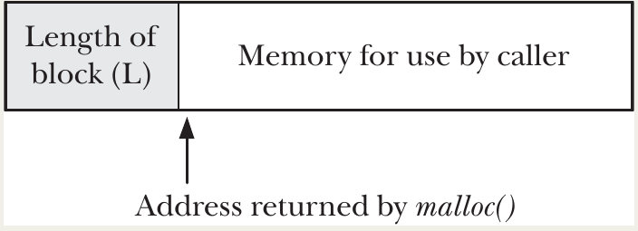
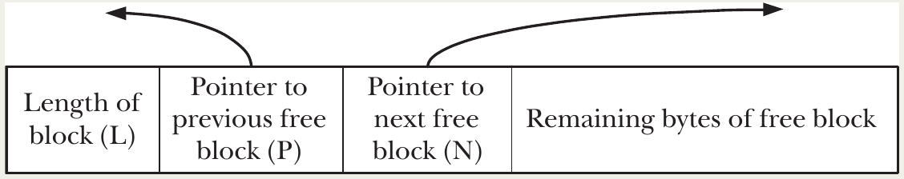
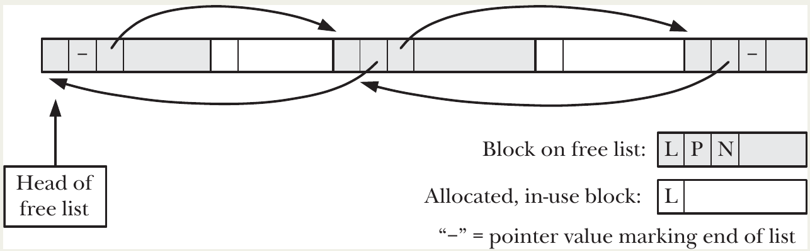

# Memory Allocation

## Allocating Memory on the Heap

### Adjusting the Program Break: brk() and sbrk()

- The **heap** is the region used for **dynamic memory allocation**.
- It starts immediately after the uninitialized data segment (`.bss`).
- It grows **upward** (toward higher addresses) as more memory is allocated.
- The kernel tracks the top of the heap via the **program break**.

#### How Allocation Works at the Lowest Level

- Initially, program break is just past the end of `.bss`.
- Increasing the program break → **virtual memory** is allocated (contiguous addresses become valid).
- **Physical memory pages** are allocated **lazily** — only when the process first accesses (reads/writes) an address in a new page (via page fault mechanism).
- Normal programs use `malloc()`/`free()` (described next), but these are built on top of the primitive system calls below.

```c
#include <unistd.h>

int brk(void *end_data_segment);      // Set program break absolutely
void *sbrk(intptr_t increment);       // Adjust program break relatively
```

1. **`brk(end_data_segment)`**
   - Sets the program break to exactly the address specified.
   - Address is **rounded up** to the next page boundary (virtual memory allocated in pages).
   - Returns 0 on success, –1 on error.

2. **`sbrk(increment)`**
   - **Linux**: Library function wrapping `brk()`.
   - Adds `increment` to current break:
     - `increment > 0`: Grow heap (allocate).
     - `increment < 0`: Shrink heap (deallocate – rarely used directly).
     - `increment == 0`: Return current break without changing it (useful for monitoring heap size).
   - On success: Returns **previous** program break (i.e., pointer to start of newly allocated region if growing).
   - On error: Returns `(void *) -1`.

```c
void *current_break = sbrk(0);           // Get current break
void *new_memory = sbrk(4096);           // Allocate ~4KB
if (new_memory == (void *)-1) {
    // Error
}
// new_memory points to start of new block
// current_break + 4096 ≈ new program break
```

#### Important Limitations and Dangers
- **Never set break below initial value** (just after `.bss`):
  - Can make parts of `.data` or `.bss` inaccessible → likely **segmentation fault** (`SIGSEGV`).
- Upper limit depends on:
  - Process resource limit `RLIMIT_DATA` (Section 36.3)
  - Location of shared libraries, memory mappings (`mmap`), shared memory
- **Not portable**:
  - SUSv2 marked `brk()`/`sbrk()` as **LEGACY**.
  - SUSv3 **removed** them from the standard.
  - Still available on Linux and most UNIX systems, but **avoid in new code** — use `malloc()` family instead.

### Allocating Memory on the Heap: malloc() and free()

#### Advantages of `malloc()` over `brk()`/`sbrk()`
- **Standardized** in the C language (ANSI C / SUSv3) → portable across all UNIX/POSIX systems.
- **Thread-safe** — safe to use in multithreaded programs (glibc implementation uses locks).
- **Fine-grained allocation** — can request memory in **small units** (bytes), not page-sized chunks.
- **Flexible deallocation** — any allocated block can be freed at any time; freed blocks are placed on a **free list** and **recycled** for future allocations.

#### Core Functions

1. **`malloc()`**
   ```c
   #include <stdlib.h>
   void *malloc(size_t size);
   ```
   - Allocates `size` bytes of **uninitialized** memory on the heap.
   - Returns a **properly aligned** pointer (usually 8- or 16-byte boundary) suitable for any C data type.
   - Returns `NULL` on failure (e.g., out of memory) and sets `errno` (typically `ENOMEM`).
   - **Always check for `NULL`**!
   - `malloc(0)`: May return `NULL` **or** a unique pointer that can be passed to `free()` (Linux/glibc returns a small block).

2. **`free()`**
   ```c
   #include <stdlib.h>
   void free(void *ptr);
   ```
   - Deallocates a block previously returned by `malloc()`, `calloc()`, `realloc()`, etc.
   - If `ptr == NULL`, does **nothing** (safe to call).
   - **Undefined behavior** if:
     - `ptr` is not a valid allocated pointer
     - `ptr` is already freed (double free)
     - `ptr` is corrupted (e.g., buffer overflow into header)

#### How `free()` Manages the Program Break
- **Usually does NOT lower the program break** — instead:
  - Adds the freed block to an internal **free list**.
  - Coalesces adjacent free blocks to reduce fragmentation.
  - Recycles these blocks for future `malloc()` calls.
- Reasons:
  - Freed blocks are typically **in the middle** of the heap → can't shrink break 🤷‍♀️.
  - Reduces expensive `sbrk()` system calls.
  - Many programs hold or repeatedly reallocate memory → shrinking wouldn't help.

- **Exception**: When a **large enough contiguous free block** exists at the **top of the heap**, glibc `free()` will call `sbrk()` to **lower the program break**.
  - Threshold: typically ~128 KB (tunable via `mallopt()`).

#### Demonstration Program (Listing 7-1: `free_and_sbrk`)
- Allocates `numAllocs` blocks of `blockSize` bytes.
- Frees blocks in a configurable pattern.
- Prints program break before/after allocation and after freeing.

**Key Observations from Examples**:
1. Freeing **scattered** blocks (e.g., every 2nd block) → **no change** in program break.
2. Freeing **all but the last** blocks → still **no change** (top block not free).
3. Freeing a **contiguous region at the top** → program break **decreases** (glibc shrinks heap).

#### To `free()` or Not to `free()`?

- When a process terminates, **all heap memory is automatically reclaimed** by the kernel.
- Many programs **omit `free()`** calls for memory held until exit:
  - Saves CPU time (especially with many small allocations).
  - Simpler code.
- **Reasons to explicitly `free()`**:
  - Improves **readability and maintainability**.
  - Essential when using **memory leak detectors** (e.g., valgrind, mtrace) — unfreed memory is reported as a leak.
  - Good habit for long-running programs or when memory usage patterns vary.

### Implementation of malloc() and free()

#### How `malloc()` Works (Simplified)
1. **Search free list** for a suitable block:
   - Uses strategies like **first-fit** or **best-fit**.
   - If exact match → return it.
   - If larger → **split** it: return requested size, leave remainder on free list.

2. **No suitable block** → grow heap:
   - Calls `sbrk()` to increase program break.
   - Allocates in **larger chunks** (multiples of page size) to reduce system call overhead.
   - Excess goes onto free list.

#### How `free()` Works and the "Hidden Header" Trick
- `malloc()` allocates **extra bytes** at the start of each block to store metadata:
  - At minimum: an **integer** with the **block size**.
  - Pointer returned to caller points **just past** this header.
  <p align="center"></p>

- When freeing:
  - `free()` uses the hidden size field to know how many bytes to return to the free list.
  - Inserts the block into a **doubly linked free list** by overwriting the **beginning bytes of the block itself** with `prev` and `next` pointers'
  <p align="center"></p>

Over time, allocated and free blocks become **intermingled** in the heap.
  <p align="center"></p>

👉 This design is efficient but fragile — the heap is full of hidden control structures that the program must **never touch**.

#### Common (and Dangerous) Programming Errors
Because C allows arbitrary pointer arithmetic, it's easy to corrupt `malloc`'s internal structures:

| Error | Consequence |
|-------|-------------|
| **Buffer overflow** (write past end of allocated block) | Overwrite next block's size/header → corruption of free list |
| **Off-by-one** or faulty pointer arithmetic | Accidentally modify hidden size field or free-list pointers |
| **Double free** (`free(ptr)` twice) | Corrupts free list → crash or unpredictable behavior (glibc often SEGVs) |
| **Free invalid pointer** (not from `malloc()`, or corrupted) | Undefined behavior — heap corruption |
| **Memory leak** (forget to `free()` in long-running program) | Heap grows until virtual memory exhausted → future `malloc()` fails |

Example of disaster:
- Overwrite a block's hidden size to be larger than actual.
- `free()` that block → records oversized block on free list.
- Later `malloc()` → allocates overlapping regions → two pointers to overlapping memory → silent data corruption.

#### Rules to Avoid Heap Corruption
1. **Never access bytes outside** an allocated block (no off-by-one, no bad loops).
2. **Never double-free** the same pointer.
3. **Never free** a pointer not returned by `malloc()`/`calloc()`/`realloc()`.
4. **Always free** memory in long-running programs (shells, daemons) to prevent **memory leaks**.

#### glibc Tools for Detecting `malloc()` Bugs

| Tool | How to Use | Purpose |
|------|------------|---------|
| `MALLOC_TRACE` + `mtrace()`/`muntrace()` | Set `MALLOC_TRACE=/path/to/file`, call `mtrace()` in code, analyze with `mtrace` script | Logs all malloc/free calls → find leaks/unmatched frees |
| `mcheck()`/`mprobe()` | Link with `-lmcheck` | Runtime consistency checks (e.g., buffer overruns) |
| `MALLOC_CHECK_` environment variable | `MALLOC_CHECK_=1` (diagnostic) or `2` (abort on error) | Simple, no recompilation needed; catches common errors fast |
| **Note**: Ignored in set-user-ID/set-group-ID programs for security.

#### Third-Party Malloc Debugging Libraries
Replace standard `malloc` by linking against a debugging library (for development only — slower, more memory):

- **Electric Fence** – uses virtual memory to catch overruns immediately.
- **dmalloc** – extensive checking and logging.
- **Valgrind** (especially **Memcheck**) – industry standard; catches leaks, overruns, invalid frees, etc., without recompiling.
- **Insure++** – commercial tool with deep checking.

#### Non-Portable glibc Extensions for Monitoring/Control
- `mallopt()` – Tune `malloc` behavior (e.g., threshold for shrinking heap, max size before using `mmap()`).
- `mallinfo()` – Returns stats (heap usage, free chunks, etc.).

**Not portable** — parameters and availability vary across UNIX systems.

### Other Methods of Allocating Memory on the Heap

#### 1. `calloc()` – Allocate and Zero-Initialize an Array
```c
#include <stdlib.h>
void *calloc(size_t numitems, size_t size);
```
- Allocates space for `numitems` objects, each of `size` bytes.
- Total bytes: `numitems × size` (overflow-checked on modern glibc).
- **Initializes all bytes to 0** (unlike `malloc()`).
- Returns pointer to block or `NULL` on failure.

**Typical use**:
```c
struct myStruct *p = calloc(1000, sizeof(struct myStruct));
if (p == NULL) errExit("calloc");
```
- Equivalent to `malloc(1000 * sizeof(struct myStruct))` + `memset(..., 0, ...)`, but atomic and slightly more efficient.

#### 2. `realloc()` – Resize a Previously Allocated Block
```c
#include <stdlib.h>
void *realloc(void *ptr, size_t size);
```
- Changes the size of the block pointed to by `ptr` (previously returned by `malloc()`, `calloc()`, or `realloc()`) to `size` bytes.
- Returns pointer to the (possibly moved) resized block, or `NULL` on error.
- **Key behaviors**:
  - If `size` > old size → additional bytes are **uninitialized**.
  - If `size` < old size → block is shrunk (excess returned to free list).
  - If `ptr == NULL` → behaves like `malloc(size)`.
  - If `size == 0` → behaves like `free(ptr)` then `malloc(0)`.

**How resizing works** (glibc strategy):
- If possible: **extend in place** (coalesce with next free block or grow heap via `sbrk()`).
- If not possible (e.g., block in middle of heap): **allocate new block**, copy data, free old block → expensive 🫤!

**⚠️: May move the block**
- Returned pointer may differ from `ptr`.
- All pointers into the old block (except offset from start) become **invalid**.

**Safe usage pattern** (avoid losing pointer on failure):
```c
void *nptr = realloc(ptr, newsize);
if (nptr == NULL) {
    // Handle error — original ptr is still valid!
} else {
    ptr = nptr;  // Update only on success
}
```

**Advice**: Minimize `realloc()` calls — frequent resizing (especially growing) is CPU-intensive.

#### 3. Aligned Memory Allocation

Some applications (e.g., vectorized code, direct I/O) require memory aligned on larger boundaries than the default (usually 8/16 bytes).

##### a. `memalign()` (glibc/non-standard)
```c
#include <malloc.h>
void *memalign(size_t boundary, size_t size);
```
- Allocates `size` bytes aligned on a multiple of `boundary` (must be power of 2).
- Returns aligned pointer or `NULL` on error.
- **Not in SUSv3**, availability varies.
- Can be freed with `free()` on glibc (safe).

##### b. `posix_memalign()` (standardized in SUSv3)
```c
#include <stdlib.h>
int posix_memalign(void **memptr, size_t alignment, size_t size);
```
- Allocates `size` bytes aligned on `alignment`.
- `alignment` must be power of 2 **and** multiple of `sizeof(void *)` (typically 4 or 8).
- Stores pointer in `*memptr`.
- Returns **0** on success, or **error code** (e.g., `EINVAL`, `ENOMEM`) on failure — **not -1**.

**Example** (allocate 65,536 bytes on 4096-byte boundary):
```c
void *memptr;
int s = posix_memalign(&memptr, 1024 * sizeof(void *), 65536);
if (s != 0) handle_error(s);  // e.g., EINVAL or ENOMEM
```

- Memory can be freed with `free(memptr)`.

#### Summary Table

| Function             | Purpose                              | Initializes? | Can Move Block? | Special Notes                                      |
|----------------------|--------------------------------------|--------------|-----------------|----------------------------------------------------|
| `malloc(size)`       | General allocation                   | No           | N/A             | Uninitialized, default alignment                   |
| `calloc(n, size)`    | Array of n items, zeroed             | Yes (all 0)  | N/A             | Safer for arrays/structs                           |
| `realloc(ptr, size)` | Resize existing block                | No (new bytes) | Yes           | Expensive if relocation needed; use return value    |
| `memalign(boundary, size)` | Aligned allocation (non-standard) | No           | N/A             | glibc-specific header, power-of-2 boundary         |
| `posix_memalign()`   | Aligned allocation (standard)        | No           | N/A             | Returns error code, stricter alignment rules       |

## Allocating Memory on the Stack: alloca()

```c
#include <alloca.h>    // Or <stdlib.h> on some systems
void *alloca(size_t size);
```
- Allocates `size` bytes of memory **within the current function's stack frame**.
- Returns a pointer to the allocated block (no `NULL` on failure — see risks below).
- Memory is **automatically freed** when the function returns (stack frame is popped).

**Key differences from `malloc()`**:
- **Do NOT** call `free()` on `alloca()`-allocated memory (would corrupt stack).
- **Cannot** use `realloc()` to resize it.
- No explicit deallocation needed.

#### How `alloca()` Works
- Implemented as **inline compiler code**: simply subtracts `size` from the stack pointer (on downward-growing stacks).
- Allocates space **above** the current frame (toward higher addresses, but within the frame).
- Extremely **fast**:
  - No system calls.
  - No free-list maintenance.
- Memory is reclaimed automatically when the function returns (stack pointer restored).

#### Advantages Over `malloc()`
| Advantage | Explanation |
|-----------|-------------|
| **Speed** | Inline adjustment of stack pointer — much faster than `malloc()`'s bookkeeping. |
| **Automatic cleanup** | Freed on function return — no need to track and `free()` on all exit paths. Simplifies code. |
| **No memory leaks with nonlocal jumps** | Perfect with `longjmp()` or `siglongjmp()` (e.g., from signal handlers): as stack unwinds, all `alloca()` memory is automatically discarded. Impossible to leak. |
| **No fragmentation** | Stack memory is contiguous and reused per call. |

#### Risks and Limitations
- **No error checking**:
  - If request exceeds available stack space → **stack overflow**.
  - Behavior is **undefined**: may crash immediately (`SIGSEGV`), corrupt data, or cause subtle bugs.
  - No `NULL` return to signal failure (unlike `malloc()`).
- **Cannot use in function arguments** (dangerous!):
- **Portability**:
  - **Not in SUSv3** (not standardized).
  - Available on most UNIX systems (Linux/glibc, BSD, etc.), but header may be `<stdlib.h>` on some.
- **Stack size is limited** (typically 8 MB on Linux) → not suitable for large allocations.

#### When to Use `alloca()`
- Small, temporary buffers needed only until function return.
- Performance-critical code where allocation speed matters.
- Complex functions with many return paths (avoids manual `free()` on each path).
- Especially useful with `longjmp()`/`siglongjmp()` in signal handlers or error recovery (guarantees no leaks).
