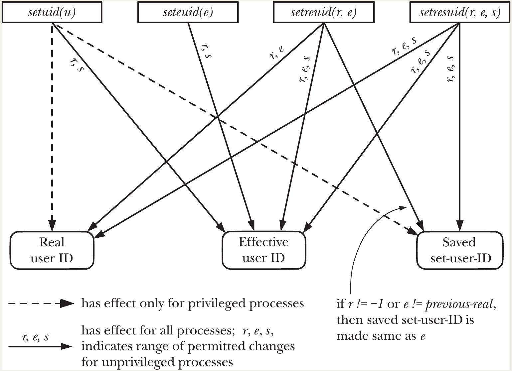

# Process Credentials

Every process has a set of associated numeric user identifiers (UIDs) and group identifiers (GIDs). Sometimes, these are referred to as process credentials. These identifiers are as follows:

- real user ID and group ID;
- effective user ID and group ID;
- saved set-user-ID and saved set-group-ID;
- file-system user ID and group ID (Linux-specific);
- supplementary group IDs.

## Real User ID and Real Group ID

- Represent the **true identity** of the user/group running the process. It is the ID of the user/group who **started the process**.
- Set during login: login shell gets them from fields 3 and 4 of the user's `/etc/passwd` entry.
- Inherited by all child processes (via `fork()`).
- Normally unchanging throughout the process lifetime (except by `root`).
- Used mainly for **accounting** (e.g., _who owns the process_) and some security checks.

## Effective User ID and Effective Group ID

- On **most UNIX systems** (and Linux, with minor differences noted in Section 9.5):
  - The **effective UID**, **effective GID**, and **supplementary group IDs** together determine the **permissions** granted to a **process** when it performs operations.
  - 💡 It is what the kernel looks at to decide if you have the "right" to access a file, run a specific command, or use a system resource.
- Typical uses:
  - **File access** (read/write/execute permissions checked against file owner/group and process effective/supplementary IDs).
  - **System V IPC objects** (shared memory, semaphores, message queues) — ownership checked similarly.
  - **Sending signals**: a process can signal another only if effective UID matches real/effective UID of target (or is root).
  - Many other system calls (e.g., binding privileged ports <1024, changing ownership, etc.).
- A process with **effective UID == 0** (root) is **privileged** (superuser).
  - Can bypass most permission checks.
  - Can perform restricted system calls (e.g., `setuid()`, `mount()`, `kill()` any process).
- Linux later adds **capabilities** (Chapter 39): splits root privileges into finer-grained units (e.g., `CAP_SYS_ADMIN`, `CAP_KILL`) that can be enabled/disabled independently.
- By default, **effective UID/GID == real UID/GID**.
  - 📌 Process runs with the privileges of the actual user who started it.
- Effective IDs can be changed in **two main ways**:
  1. **Explicitly via system calls** (covered in Section 9.7):
  - `seteuid()`, `setegid()`, `setreuid()`, `setregid()`, etc.
  - Allows temporary privilege changes.
  2. **Automatically via set-user-ID and set-group-ID programs** (covered later):
  - When executing a program with the **set-user-ID** bit set → effective UID becomes the **owner** of the executable file.
  - Similarly for set-group-ID → effective GID becomes the **group** of the file.
  - This is the foundation for programs like `passwd`, `sudo`, `ping` that need temporary elevated privileges.

## Set-User-ID and Set-Group-ID Programs

- A **set-user-ID program**:
  - When executed, sets the process's **effective UID** to the **owner** (user ID) of the executable file.
- A **set-group-ID program**:
  - Sets the process's **effective GID** to the **group** owner of the file.
- This gives the process **privileges it wouldn't normally have** (e.g., root privileges if owned by root).
- Every file has two special permission bits: **set-user-ID** and **set-group-ID**.
- Set using `chmod`:
  ```bash
  chmod u+s prog    # Set-user-ID bit
  chmod g+s prog    # Set-group-ID bit
  ```
- When displayed with `ls -l`, the execute bit `x` becomes `s`:
    ```py
    -rwsr-sr-x  1 root root 302585 Jun 26 15:05 prog
    ```
  - `s` in owner execute position → set-user-ID
  - `s` in group execute position → set-group-ID
- When a set-user-ID program runs:
  - **Effective UID** = **owner UID** of the file (not the real user).
  - Real UID stays the same (the actual user who ran it).
- Same for set-group-ID → effective GID = file's group owner.
- 👉 Process gains the **privileges** of the file owner/group for the duration of the program.

#### Common Real-World Examples

| Program     | Set-ID Type  | Owner | Purpose                                                                      |
| ----------- | ------------ | ----- | ---------------------------------------------------------------------------- |
| `passwd(1)` | set-user-ID  | root  | Allows ordinary users to change their own password (writes to `/etc/shadow`) |
| `mount(8)`  | set-user-ID  | root  | Allows mounting filesystems (privileged operation)                           |
| `su(1)`     | set-user-ID  | root  | Switch user (needs root privileges)                                          |
| `wall(1)`   | set-group-ID | tty   | Write message to all terminals (access to tty devices)                       |

#### Special Cases and Terminology

- **set-user-ID-root program**: Owned by root with set-user-ID bit → process gains **full superuser privileges** (effective UID = 0).
- **set-user-ID to non-root user**: Gains privileges of that specific user (not root) — useful for restricted access to a resource.
- **Both bits set**: Possible (uncommon) — process gets both effective UID and GID from file owner/group.

#### Example from the Book

To allow any user to run the password-checking program (Listing 8-2) that needs `/etc/shadow` access:

```bash
# chown root check_password     # Make it owned by root
# chmod u+s check_password      # Enable set-user-ID bit
# ls -l check_password
-rwsr-xr-x 1 root users 18150 Oct 28 10:49 check_password
```

Now ordinary users can run it and authenticate against the shadow file.
- Extremely powerful: Lets unprivileged users perform privileged tasks safely.
- Extremely dangerous if the program is poorly written 🤷 → security vulnerabilities.

## Saved Set-User-ID and Saved Set-Group-ID

#### When and How Saved IDs Are Set

During every `exec()` (program execution), the kernel performs (among other steps):
1. **If the file has the set-user-ID bit set**:
   - Effective UID ← **owner UID** of the executable file.
   - Otherwise, effective UID remains unchanged.
   - (Same logic applies to set-group-ID → effective GID ← file's group owner.)
2. **Regardless of the set-ID bits**:
   - **Saved set-user-ID** ← current **effective UID** (after step 1).
   - **Saved set-group-ID** ← current **effective GID** (after step 1).

This happens **every time** a program is executed — even for normal (non-set-ID) programs.

#### Example: Running a Set-User-ID-Root Program

- Initial process state (before `exec()`):
  - Real UID = 1000
  - Effective UID = 1000
  - Saved set-UID = 1000
- Executes a **set-user-ID program owned by root** (UID 0):
- After `exec()`:
  - **Real UID** = 1000 (unchanged)
  - **Effective UID** = 0 (because set-user-ID bit was set → file owner UID)
  - **Saved set-UID** = 0 (copied from the new effective UID)
👉 Process now runs with **full superuser privileges** (effective UID = 0), but the **saved set-UID remembers** that it can return to 0 later.

#### Purpose of Saved IDs: Temporary Privilege Dropping

- The saved IDs allow a program to:
  - **Start with elevated privileges** (effective = file owner, e.g., root).
  - **Temporarily drop privileges** (set effective UID back to real UID = 1000 → become unprivileged).
  - **Later regain privileges** (set effective UID back to **saved set-UID** = 0).
- 👍 This is **essential for secure programming**:
  - A set-user-ID-root program should **not** run as root the entire time.
  - It should drop to the real (unprivileged) user whenever possible.
  - Use saved set-UID to **regain root** only when needed.
- Various system calls allow switching:
  - `seteuid()`, `setegid()` → change only effective ID.
  - `setreuid()`, `setregid()` → change real and/or effective (with restrictions).
  - A privileged process can set effective to **saved** or **real** UID/GID.

## File-System User ID and File-System Group ID

- On **most UNIX systems** (and historically on Linux too):
  - **Effective UID** and **effective GID** (plus supplementary groups) determine:
    - File access permissions (open, read, write, chmod, chown, etc.)
    - Creation of new files (ownership)
    - Other privileged operations
- On **Linux** (since kernel 1.2):
  - File-system operations (opening files, chmod, chown, etc.) use the **file-system UID/FSGID** instead of the effective UID/GID.
  - All **other** privilege checks (signals, binding low ports, etc.) still use the **effective** UID/GID.

#### Default Behavior
- Normally, **FSUID = effective UID** and **FSGID = effective GID** (and thus usually = real IDs too).
- Whenever the **effective** UID or GID changes (via system call or exec of set-user-ID/set-group-ID program), the **file-system** IDs are **automatically updated** to match.
- 👉 In almost all practical cases, Linux behaves **exactly like other UNIX implementations** — file permissions are checked using effective IDs 🤷‍♀️.

#### When and Why They Can Differ
- The only way FSUID/FSGID differ from effective UID/GID is if you **explicitly** set them using the **Linux-specific** system calls:
  ```c
  int setfsuid(uid_t fsuid);
  int setfsgid(gid_t fsgid);
  ```
- These calls are **rarely used** in modern code.

#### Historical Reason for File-System IDs

- Introduced in **Linux 1.2** (early 1990s) to solve a problem with the **Linux NFS server**.
- Old signal rules (pre-2.0): A process could send a signal to another if sender's **effective UID** matched target's **real** or **effective** UID.
- NFS server needed to:
  - Access files **as if** it had the client's effective UID/GID → needed to change its own IDs.
  - But if it changed effective UID, it became **vulnerable** to signals from unprivileged users.
- 👉 Use **separate** file-system IDs for file access, while keeping **effective** IDs unchanged → safe from signals.

#### Modern Status

- From **kernel 2.0** onward, Linux adopted **POSIX/SUSv3** signal rules (Section 20.5):
  - Signal permission no longer depends on effective UID of target.
  - File-system IDs are **no longer strictly necessary**.
- Today, the same result can be achieved by **temporarily changing effective** UID/GID (drop to unprivileged, do file operation, regain via saved IDs).
- File-system IDs remain **for backward compatibility** with old software (especially NFS-related) 🤷.

#### Practical Impact

- In virtually all modern programs, **FSUID/FSGID == effective UID/GID**.
- Therefore, the book (and most documentation) describes file permission checks in terms of **effective IDs** — the presence of file-system IDs **seldom makes a difference** on current Linux.
- You can generally **ignore** FSUID/FSGID unless:
  - You're writing/maintaining very old code.
  - You're dealing with legacy NFS servers.
  - You're using `setfsuid()`/`setfsgid()` explicitly (very rare).

## Supplementary Group IDs

- Supplementary group IDs are a **set** (list) of **additional numeric group IDs** (GIDs) that a process is a member of.
- They are **in addition to** the process's **primary group** (defined by the GID field in `/etc/passwd`).
  - Used **together with** the **effective UID/GID** (and on Linux, file-system UID/GID) to determine **access permissions** for:
    - Files and directories (read/write/execute)
    - System V IPC objects (shared memory, semaphores, message queues)
    - Other system resources that use group-based authorization
- A **new process** (created via `fork()`) **inherits** its **complete set** of supplementary group IDs from its parent.
- The **login shell** obtains its supplementary groups from the **system group file** (`/etc/group`):
  - All entries where the user's login name appears in the **member list** (fourth field).

#### How Supplementary Groups Are Determined (Example)

User `ayoub` has primary group `users` (GID 100 from `/etc/passwd`):
```c
ayoub:x:1001:100:Ayoub:/home/ayoub:/bin/bash
```

And belongs to supplementary groups `staff` and `developers` (listed in `/etc/group`):
```c
staff:x:101:ayoub,martin
developers:x:105:ayoub,teamlead
```

- ➡️ Process credentials for `ayoub`'s shell/login:
  - Real UID: 1001
  - Effective UID: 1001 (unless setuid program)
  - Primary GID: 100 (`users`)
  - Supplementary GIDs: 101 (`staff`), 105 (`developers`)
- ➡️ `ayoub` gets file access rights from **all four groups**: `users`, `staff`, `developers`, and his primary group.

## Retrieving and Modifying Process Credentials

- Credentials include: **real**, **effective**, **saved set**, **file-system** (Linux-specific), and **supplementary** UIDs/GIDs.
- **Privileged process** (traditional): effective UID = 0 (root/superuser).
- **Modern Linux** uses **capabilities** (Chapter 39) instead of blanket root privileges:
  - **CAP_SETUID**: Allows arbitrary changes to **user IDs** (real, effective, saved set).
  - **CAP_SETGID**: Allows arbitrary changes to **group IDs** (real, effective, saved set, supplementary).
- 👉 Most credential changes require **one of these capabilities** (i.e., root or a process with the capability granted).
- `/proc/PID/status` provides a quick, human-readable view:
  ```
  Uid:    1000    1000    1000    1000
  Gid:    1000    1000    1000    1000
  Groups: 1000 27 100  ...
  ```
  - Order: **real, effective, saved set, file-system** (for both Uid and Gid).

#### Overview of APIs (Detailed Coverage in Following Subsections)
The book divides them into:

1. **Retrieval functions** (get*):
   - `getuid()`, `geteuid()`, `getresuid()` → user IDs
   - `getgid()`, `getegid()`, `getresgid()` → group IDs
   - `getgroups()` → supplementary groups
2. **Modification system calls** (set*):
   - `setuid()`, `seteuid()`, `setreuid()`, `setresuid()` → user IDs
   - `setgid()`, `setegid()`, `setregid()`, `setresgid()` → group IDs
   - `setgroups()`, `initgroups()` → supplementary groups
   - `setfsuid()`, `setfsgid()` → file-system IDs (Linux-specific)
3. **Portability**:
   - Only a subset are in **SUSv3** (e.g., `setuid()`, `setgid()`, `seteuid()`, `setegid()`, `getuid()`, `geteuid()`, etc.).
   - Others are **widely available** (BSD, Solaris, etc.) or **Linux-specific** (e.g., `getresuid()`, `setresuid()`, `setfsuid()`).

#### General Rules for Changing Credentials
- Only **privileged processes** (effective UID=0 or with `CAP_SETUID`/`CAP_SETGID`) can arbitrarily change IDs.
- Unprivileged processes can usually **only lower** their privileges (e.g., drop effective UID to real UID).
- **Saved set-IDs** are used to **regain** dropped privileges (critical for `set-user-ID` programs).

#### Summary Table (Preview of Table 9-1 – Full Details in Book)

| Call               | Changes Which IDs?                  | Privileged? | Can regain saved? | Portability       |
|--------------------|-------------------------------------|-------------|-------------------|-------------------|
| `setuid()`         | Real + effective + saved (sometimes) | Yes         | Sometimes         | SUSv3             |
| `seteuid()`        | Effective only                      | Sometimes   | No                | SUSv3             |
| `setreuid()`       | Real + effective                    | Yes         | No                | Widely available  |
| `setresuid()`      | Real + effective + saved            | Yes         | Yes               | Linux/BSD         |
| `setgroups()`      | Supplementary groups                | Yes         | —                 | Widely available  |
| `initgroups()`     | Supplementary (from `/etc/group`)   | Yes         | —                 | Widely available  |

### Retrieving Real and Effective IDs (Always Successful)

These four simple system calls return the current IDs of the calling process:

```c
uid_t getuid(void);     // Real user ID
uid_t geteuid(void);    // Effective user ID
gid_t getgid(void);     // Real group ID
gid_t getegid(void);    // Effective group ID
```

- Always succeed (no error return).
- Frequently used to check current privilege level (e.g., `geteuid() == 0` → privileged).

### Modifying Effective IDs:

```c
int setuid(uid_t uid);
int setgid(gid_t gid);
```

- Return **0** on success, **–1** on error (sets `errno`).
- **Rules for `setuid()`** (analogous for `setgid()` with group IDs):
  - **Unprivileged process** (effective UID ≠ 0):
    - Can **only** change **effective UID** to match either:
      - Current **real UID**, or
      - Current **saved set-user-ID**.
    - Attempts to set any other value → `EPERM`.
    - Useful mainly in **set-user-ID programs** (where real, effective, and saved IDs may differ).
  - **Privileged process** (effective UID = 0):
    - Can set **real UID**, **effective UID**, and **saved set-user-ID** all to the specified `uid` (if `uid ≠ 0`).
    - This is a **one-way trip** — once real and saved are changed to non-zero, privileges are **permanently lost**.
    - If you want to **regain** privileges later → use `seteuid()` or `setreuid()` instead.

**Best practice example** (irrevocably drop all privileges in a **set-user-ID-root** program):
```c
if (setuid(getuid()) == -1)
  errExit("setuid");
// Now: real = effective = saved = original real UID (usually non-root)
```

**For set-group-ID programs**:
- `setgid()` follows similar rules, but **changing group IDs does not lose privileges** (privileges are tied to effective UID).
- A privileged process can freely change group IDs to any value.

#### Modifying Only the Effective ID: `seteuid()` and `setegid()`

```c
int seteuid(uid_t euid);
int setegid(gid_t egid);
```

- Return **0** on success, **–1** on error.
- **Rules** (same for both):
  - **Unprivileged process**:
    - Can change effective ID **only** to match current **real UID/GID** or **saved set-UID/GID**.
    - Same effect as `setuid()`/`setgid()` for unprivileged processes (except for some BSD differences).
  - **Privileged process**:
    - Can change effective ID **to any value**.
    - If set to nonzero → process **loses privilege** (but can regain it later using saved ID).
- 👉 **Preferred usage** in set-user-ID/set-group-ID programs:
  - Temporarily drop privileges: `seteuid(getuid())`
  - Later regain: `seteuid(saved_euid)` (where `saved_euid = geteuid()` at startup)

**Example** (safe temporary privilege drop):
```c
uid_t orig_euid = geteuid();           // Usually 0 in setuid-root program
if (seteuid(getuid()) == -1) errExit("seteuid");   // Drop to real (unprivileged)

// Do unprivileged work...
if (seteuid(orig_euid) == -1) errExit("seteuid");  // Regain privileges
```

### Modifying real and effective IDs

```c
int setreuid(uid_t ruid, uid_t euid);   // Change real and/or effective user ID
int setregid(gid_t rgid, gid_t egid);   // Change real and/or effective group ID
```

- Allow a process to **independently** change its **real** and **effective** user/group IDs in a single call — more flexible than `setuid()`/`setgid()` or `seteuid()`/`setegid()`.
- Return **0** on success, **–1** on error (sets `errno`).
- Use **–1** for the argument you **do not** want to change.

#### Rules for `setreuid()` (analogous for `setregid()`)

1. **Unprivileged process** (effective UID ≠ 0):
   - **Real UID** (`ruid`):
     - Can only be set to current **real UID** (i.e., no change) or current **effective UID**.
     - SUSv3 says behavior is **unspecified** for setting real UID to real/effective/saved values → varies across implementations.
   - **Effective UID** (`euid`):
     - Can only be set to current **real UID**, **effective UID** (no change), or **saved set-user-ID**.
   - Attempts to set invalid values → `EPERM`.
2. **Privileged process** (effective UID = 0):
   - Can set **real UID** and **effective UID** to **any value**.
3. **Effect on saved set-user-ID** (🚨):
   - Saved set-UID is **also updated** to the **new effective UID** if **either**:
     - `ruid != -1` (real UID is being changed, even to same value), **or**
     - `euid` is set to something **different** from the **old real UID**.
   - Converse: If you **only** set `euid` to match current **real UID** (and `ruid = -1`), then **saved set-UID remains unchanged** → can later regain privileges.
   - SUSv3 does **not** specify this behavior; SUSv4 does (Linux follows SUSv4 rules).

**Same logic** applies to `setregid()` (with group IDs).

#### Common and Safe Usage Patterns

1. **Permanently drop all privileges** (set-user-ID-root program):
   ```c
   if (setreuid(getuid(), getuid()) == -1)
       errExit("setreuid");
   ```
   - Sets real = effective = current real UID.
   - Also sets saved set-UID to real UID → privileges **permanently lost**.
2. **Temporarily drop privileges** (safe for regaining later):
   ```c
   if (setreuid(-1, getuid()) == -1) errExit("setreuid");   // Only change effective
   // Do unprivileged work...
   if (setreuid(-1, saved_euid) == -1) errExit("setreuid"); // Regain (saved unchanged)
   ```
   - Because `ruid = -1` and `euid == real UID` → saved set-UID **not** updated.
3. **Change both real and effective** (careful order):
   - If changing both user and group credentials:
     - Call `setregid()` **first**, then `setreuid()`.
     - Reverse order fails if `setreuid()` drops privileges before `setregid()`.

### Retrieving real, effective, and saved set IDs

```c
#define _GNU_SOURCE
#include <unistd.h>

int getresuid(uid_t *ruid, uid_t *euid, uid_t *suid);
int getresgid(gid_t *rgid, gid_t *egid, gid_t *sgid);
```

- Both return **0** on success, **–1** on error (sets `errno`).
- The three pointers receive:
  - `*ruid` / `*rgid` → **real** user/group ID
  - `*euid` / `*egid` → **effective** user/group ID
  - `*suid` / `*sgid` → **saved set-user-ID** / **saved set-group-ID**

#### Why These Calls Exist
- On **most UNIX implementations** (including SUSv3/POSIX):
  - There is **no standard way** to directly retrieve the **saved set-user-ID** or **saved set-group-ID**.
  - Only real and effective IDs are accessible via `getuid()`/`geteuid()`/`getgid()`/`getegid()`.
- Linux provides `getresuid()`/`getresgid()` to fill this gap — very useful for:
  - Debugging
  - Secure credential management in set-user-ID/set-group-ID programs
  - Verifying current privilege state (especially saved IDs)

#### Key Characteristics
- **Linux-specific** — **not** in SUSv3 or SUSv4 → **not portable**.
- Require `_GNU_SOURCE` feature test macro to be defined.
- Simple and always successful unless pointers are invalid (then `EFAULT`).
- No equivalent standard functions exist on other UNIX systems (some BSDs have similar calls, but not identical).

#### Practical Use Example
```c
#define _GNU_SOURCE
#include <unistd.h>
#include <stdio.h>

int main(void) {
    uid_t ruid, euid, suid;
    if (getresuid(&ruid, &euid, &suid) == -1) {
        perror("getresuid");
        return 1;
    }

    printf("Real UID:      %u\n", ruid);
    printf("Effective UID: %u\n", euid);
    printf("Saved set-UID: %u\n", suid);

    return 0;
}
```

Output (example from a normal user):
```
Real UID:      1000
Effective UID: 1000
Saved set-UID: 1000
```

Output (from inside a set-user-ID-root program):
```
Real UID:      1000
Effective UID: 0
Saved set-UID: 0
```

### Modifying real, effective, and saved set IDs

```c
#define _GNU_SOURCE
#include <unistd.h>

int setresuid(uid_t ruid, uid_t euid, uid_t suid);
int setresgid(gid_t rgid, gid_t egid, gid_t sgid);
```

- 🧬 The **most powerful** (and Linux/BSD-specific) system calls for changing process credentials: `setresuid()` and `setresgid()`. They allow explicit, independent control over **all three** user/group IDs: **real**, **effective**, and **saved set**.
- Return **0** on success, **–1** on error (sets `errno`).
- Use **–1** for any ID you **do not** want to change.

#### Rules for `setresuid()` (analogous for `setresgid()`)

1. **Unprivileged process** (effective UID ≠ 0):
   - Can set **any** of real, effective, and saved set-user-ID **only** to values currently held by one of these three IDs.
   - In other words: can **rearrange** the three IDs in any order, but cannot introduce a **new** UID value.
2. **Privileged process** (effective UID = 0):
   - Can set **real**, **effective**, and **saved set-user-ID** to **any values** (arbitrary UIDs).
3. **Side effect on file-system UID** (Linux-specific):
   - Regardless of what else changes, the **file-system UID** is **always** set to the **new effective UID** after the call.
   - (Same applies to file-system GID with `setresgid()`.)
4. **All-or-nothing semantics**:
   - Either **all** requested changes succeed, or **none** are applied.
   - No partial updates occur (same atomicity rule applies to most credential-changing calls in this chapter).

#### Portability
- **Not in SUSv3** (or SUSv4) → **non-portable**.
- Available on **Linux** and some **BSD** variants.
- **Not** on most other commercial UNIX systems (Solaris, AIX, HP-UX, etc.).
- Use only when you specifically need to change the **saved set-ID** (most programs don’t).

#### Comparison with Other Calls

| Call              | Can Change Real? | Effective? | Saved Set? | File-System? | Privileged Needed? | Portability     |
|-------------------|------------------|------------|------------|--------------|--------------------|-----------------|
| `setuid()`        | Yes (sometimes)  | Yes        | Sometimes  | Auto         | Yes                | SUSv3           |
| `seteuid()`       | No               | Yes        | No         | Auto         | Sometimes          | SUSv3           |
| `setreuid()`      | Yes              | Yes        | Sometimes  | Auto         | Yes                | SUSv3           |
| `setresuid()`     | Yes              | Yes        | Yes        | Auto         | Yes                | **Linux/BSD**   |

`setresuid()` is the **only** standard call that lets you **explicitly set the saved set-user-ID** (very useful in complex privilege management).

#### Typical Use Cases
1. **Permanently drop all privileges** (including saved set-ID):
   ```c
   setresuid(getuid(), getuid(), getuid());
   ```
   - Real = effective = saved = original real UID → no way to regain privileges.
2. **Temporarily drop privileges** (keep saved set-ID intact):
   ```c
   setresuid(-1, getuid(), -1);   // Only change effective
   // Do unprivileged work...
   setresuid(-1, saved_euid, -1); // Regain using saved value
   ```
3. **Explicitly manipulate saved set-ID** (rare, advanced):
   - Set saved set-UID to a specific value (only privileged processes can do this).

### Retrieving and Modifying File-System IDs

```c
int setfsuid(uid_t fsuid);
int setfsgid(gid_t fsgid);
```

- **Linux-only** system calls `setfsuid()` and `setfsgid()` are the only way to **change** the file-system user ID (FSUID) and file-system group ID (FSGID) **independently** of the effective UID/GID.
- Both **always return** the **previous** value of the corresponding file-system ID (whether the call succeeds or fails) 🤷.
- No standard error indication — success/failure must be inferred from the returned previous value.
- These IDs are used **only** for **file-system-related permission checks** on Linux (open, chmod, chown, etc.).
- All other privilege checks (signals, ports < 1024, etc.) still use **effective** UID/GID.

#### Rules for `setfsuid()` (analogous for `setfsgid()`)

1. **Unprivileged process** (effective UID ≠ 0):
   - Can set FSUID **only** to one of the following current values:
     - Real UID
     - Effective UID
     - Current FSUID (no change)
     - Saved set-user-ID
2. **Privileged process** (effective UID = 0):
   - Can set FSUID **to any value**.

#### Important Implementation Quirks (Unpolished Design)
- **No retrieval functions** — there are **no** `getfsuid()` or `getfsgid()` calls.
  - The only way to discover the current FSUID/FSGID is to call `setfsuid()`/`setfsgid()` and look at the **return value** (previous value).
- **Automatic sync with effective IDs**:
  - All other credential-changing calls (`setuid()`, `seteuid()`, `setreuid()`, `exec()` of set-user-ID program, etc.) **automatically** set FSUID to match the new effective UID.
  - `setfsuid()`/`setfsgid()` are the **only** way to make FSUID differ from effective UID.

#### Modern Recommendation
- **No longer necessary** on current Linux kernels.
- The original rationale (NFS server signal vulnerability) was fixed in kernel 2.0+ (new signal rules).
- Same results can now be achieved by **temporarily changing effective IDs** (drop → do file op → regain via saved set-ID).
- **Avoid** `setfsuid()`/`setfsgid()` in **new code**, especially if portability is desired.
- They remain only for **backward compatibility** with very old software (mostly legacy NFS-related).

### Retrieving and Modifying Supplementary Group IDs

```c
int getgroups(int gidsetsize, gid_t grouplist[]);
```
- **Returns**: Number of group IDs placed in `grouplist` on success, or **–1** on error (`errno` set).
- `gidsetsize`: Size of the caller-allocated `grouplist` array.
- `grouplist`: Array where the supplementary GIDs are stored.
- **Behavior**:
  - On **Linux** and most UNIX: Returns **only supplementary** GIDs (does **not** include effective/primary GID).
  - SUSv3 allows implementations to **optionally include** the effective GID — portable code must allow for this possibility.
- **Safe sizing of `grouplist`**:
  - Maximum number of supplementary groups = **`NGROUPS_MAX`** (in `<limits.h>`).
  - On Linux:
    - Kernels < 2.6.4 → `NGROUPS_MAX = 32`
    - Kernel 2.6.4+ → `NGROUPS_MAX = 65,536`
  - To be portable and handle possible inclusion of effective GID, allocate:
    ```c
    gid_t grouplist[NGROUPS_MAX + 1];
    ```
- **Discovering the actual number at runtime** (recommended):
  - Call `getgroups(0, NULL)` → returns the number of supplementary groups (no array filled).
  - Or use:
    - `sysconf(_SC_NGROUPS_MAX)` (POSIX standard)
    - Read `/proc/sys/kernel/ngroups_max` (Linux-specific, since 2.6.4)

👉 Only **privileged processes** (effective UID = 0 or with `CAP_SETGID`) can change supplementary groups.

##### a. `setgroups()` – Replace All Supplementary Groups

```c
#define _BSD_SOURCE
#include <grp.h>

int setgroups(size_t gidsetsize, const gid_t *grouplist);
```

- Replaces the **entire** set of supplementary groups with the list in `grouplist`.
- `gidsetsize`: Number of GIDs in the array.
- Returns **0** on success, **–1** on error.
- Not in SUSv3 → widely available but **not portable** in strict POSIX code.
- Array can be empty (`gidsetsize = 0`).

##### b. `initgroups()` – Convenient Initialization from `/etc/group`

```c
#define _BSD_SOURCE
#include <grp.h>

int initgroups(const char *user, gid_t basegid);
```

- **Scans `/etc/group`** and adds **all groups** that list `user` as a member.
- Also **adds** the group `basegid` (usually the user's primary GID from `/etc/passwd`).
- Clears any previous supplementary groups and replaces them with this new set.
- **Typical use**:
  - Login programs (`login`, `sshd`, etc.) call `initgroups(username, pw->pw_gid)` after reading the password record.
  - This sets up the login shell with **all** correct supplementary groups automatically.
- Not in SUSv3 → widely available.
- Requires privilege (`CAP_SETGID`) — usually called early in login by root.

#### Summary Table: Supplementary Group Operations

| Function         | Purpose                                      | Privileged? | Portable?     | Notes |
|------------------|----------------------------------------------|-------------|---------------|-------|
| `getgroups()`    | Retrieve current supplementary GIDs          | No          | SUSv3         | May include effective GID on some systems |
| `setgroups()`    | Replace all supplementary GIDs               | Yes         | Widely avail. | Not SUSv3 |
| `initgroups()`   | Build supplementary list from `/etc/group` + base GID | Yes         | Widely avail. | Convenience for login shells |


### Summary of Calls for Modifying Process Credentials

The table below summarizes the effects of the various system calls and library functions used to change process credentials.

<p align="center"></p>


| Interface                  | Purpose and Effect (Unprivileged Process)                                                                 | Purpose and Effect (Privileged Process)                                      | Portability / Notes                                                                 |
|----------------------------|------------------------------------------------------------------------------------------------------------|-------------------------------------------------------------------------------|-------------------------------------------------------------------------------------|
| `setuid(u)`                | Changes **effective UID** to same value as current **real UID** or **saved set-UID**                       | Changes **real UID**, **effective UID**, and **saved set-UID** to any single value (one-way if nonzero) | Specified in SUSv3<br>BSD derivatives have different semantics (may change real/saved too) |
| `setgid(g)`                | Changes **effective GID** to same value as current **real GID** or **saved set-GID**                       | Changes **real GID**, **effective GID**, and **saved set-GID** to any value   | Specified in SUSv3<br>Similar rules to setuid(), but no privilege loss on GID change |
| `seteuid(e)`               | Changes **effective UID** to same value as current **real UID** or **saved set-UID**                       | Changes **effective UID** to any value                                        | Specified in SUSv3<br>Preferred for temporary privilege drop/regain in set-UID programs |
| `setegid(e)`               | Changes **effective GID** to same value as current **real GID** or **saved set-GID**                       | Changes **effective GID** to any value                                        | Specified in SUSv3<br>Analogous to seteuid() for groups                             |
| `setreuid(r, e)`           | (Independently) change **real UID** to same as current real/effective, and **effective UID** to same as real/effective/saved set-UID | (Independently) change **real** and **effective** UIDs to any values          | Specified in SUSv3<br>Can affect saved set-UID (SUSv4 behavior)                     |
| `setregid(r, e)`           | (Independently) change **real GID** and **effective GID** within allowed values (similar to setreuid)     | (Independently) change **real** and **effective** GIDs to any values          | Specified in SUSv3<br>Similar rules to setreuid()                                   |
| `setresuid(r, e, s)`       | (Independently) change **real**, **effective**, and **saved set-UID** to same as current real/effective/saved set-UID | (Independently) change **real**, **effective**, and **saved set-UID** to any values | **Not in SUSv3**<br>Linux/BSD-specific<br>Most powerful/complete control           |
| `setresgid(r, e, s)`       | (Independently) change **real**, **effective**, and **saved set-GID** within allowed values                | (Independently) change **real**, **effective**, and **saved set-GID** to any values | **Not in SUSv3**<br>Linux/BSD-specific<br>Analogous to setresuid()                 |
| `setfsuid(u)`              | Change **file-system UID** to same as current real/effective/file-system/saved set-UID                     | Change **file-system UID** to any value                                       | **Linux-specific**<br>Rarely needed today; silent failure for invalid unprivileged calls |
| `setfsgid(g)`              | Change **file-system GID** to same as current real/effective/file-system/saved set-GID                     | Change **file-system GID** to any value                                       | **Linux-specific**<br>Analogous to setfsuid(); usually unnecessary                 |
| `setgroups(n, list)`       | **Cannot** be called by unprivileged process                                                               | Set **supplementary group IDs** to any values                                 | **Not in SUSv3**<br>Available on all UNIX implementations                           |

Here is an updated and expanded version of **Table 9-1** that incorporates the supplementary information you provided about glibc implementations, saved set-ID side effects, file-system ID updates, and SUSv3 specification gaps. I've kept the table clear, concise, and consistent with the style of *The Linux Programming Interface*.

#### Additional Notes from the Supplementary Information

- **glibc implementation details**:
  - `seteuid(e)` → implemented as `setresuid(-1, e, -1)` (modern glibc) or `setreuid(-1, e)` (older glibc)
  - `setegid(e)` → implemented as `setregid(-1, e)`
  - Both allow setting to the **current effective value** (no change) — not required by SUSv3.
  - `setegid()` may change **saved set-GID** if new effective ≠ current real GID (not in SUSv3).
- **Saved set-ID side effects** (for `setreuid()`/`setregid()`):
  - Saved set-UID/GID is set to the **new effective** value if:
    - `r != -1` (real ID changed), **or**
    - `e` is different from the **old real** ID.
  - SUSv3 does **not** specify this → behavior is SUSv4 / Linux-specific.
- **File-system ID updates** (Linux-specific):
  - **All** calls that change effective UID/GID **automatically** set FSUID/FSGID to the new effective value.
  - `setresuid()`/`setresgid()` **always** update FSUID/FSGID to the (possibly unchanged) new effective value.
  - `setfsuid()`/`setfsgid()` are the **only** way to make FSUID/FSGID differ from effective IDs.
