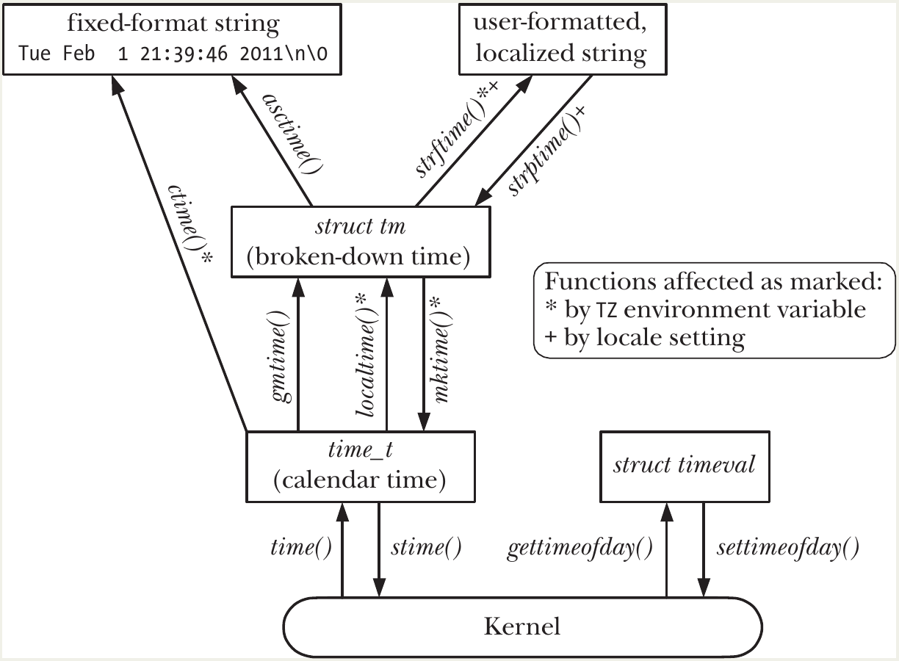

# Time

- There are two kinds of time:
  - **Real time** (also called **calendar time**, **wall-clock time**, or **elapsed time**)
    - Measured from a fixed reference point:
      - **Calendar time**: seconds since the **Epoch** (00:00:00 UTC, 1 January 1970).
      - **Elapsed time**: seconds since some arbitrary start point (e.g., process start).
    - Used for: timestamps (files, logs, database records), scheduling periodic actions, measuring external delays.
  - **Process time** (also called **CPU time**)
    - Amount of CPU time consumed by the process (user mode + kernel mode).
    - Used for: performance measurement, profiling algorithms, optimizing code.
- Modern CPUs have a built-in **hardware clock** (e.g., Timestamp Counter on x86).
- The kernel uses this to track both real time and CPU time with high precision.

## Calendar Time

1. **`time()`** – Simplest way to get seconds since the Epoch

   ```c
   time_t time(time_t *timep);
   ```

   - Returns seconds since Epoch (or `(time_t)-1` on error).
   - If `timep != NULL`, also stores the value there.
   - Most common idiom (no error checking needed in practice):
     ```c
     time_t t = time(NULL);
     ```

2. **`gettimeofday()`** – Higher-precision calendar time (microseconds)

   ```c
   int gettimeofday(struct timeval *tv, struct timezone *tz);
   ```

   - `tv` receives:
     ```c
     struct timeval {
         time_t      tv_sec;    /* seconds since Epoch */
         suseconds_t tv_usec;   /* microseconds (0–999999) */
     };
     ```
   - `tz` is **obsolete** — always pass `NULL`.
   - Precision: up to microseconds on modern x86 (via TSC register), but actual accuracy depends on hardware/kernel.

   **Example**:

   ```c
   struct timeval tv;
   if (gettimeofday(&tv, NULL) == -1) errExit("gettimeofday");
   printf("Seconds: %ld, Microseconds: %ld\n", tv.tv_sec, tv.tv_usec);
   ```

#### The Year 2038 Problem (Y2038)

- `time_t` is a **signed 32-bit integer** on 32-bit Linux systems.
- Range: **Dec 13, 1901 20:45:52** to **Jan 19, 2038 03:14:07 UTC**.
- After 2038 → overflow → dates wrap around to negative values 🤷.
- Mitigation:
  - Most systems will be **64-bit** by 2038 (`time_t` becomes 64-bit → no problem).
  - 32-bit embedded systems may still be affected.
  - Legacy data/code using 32-bit `time_t` will break.

#### Historical Notes

- `time()`: Original UNIX system call (simple seconds).
- `gettimeofday()`: Added in 4.3BSD for microsecond precision.
- `tz` argument in `gettimeofday()`: obsolete relic from early time-zone handling (never fully supported on Linux).

## Time-Conversion Functions

The figure belows shows the functions used to convert between `time_t` values and other time formats, including printable representations. These functions shield us from the complexity brought to such conversions by timezones, daylight saving time
(DST) regimes, and localization issues.

<p align="center"></p>
